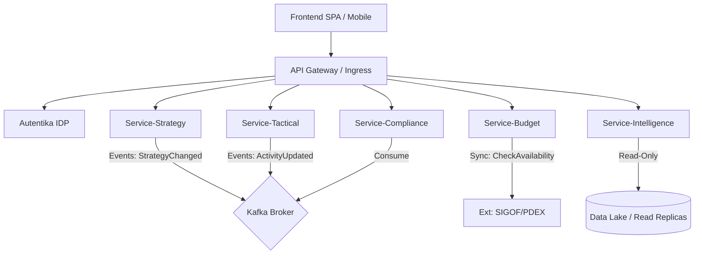

# Especificação Técnica de Backend - SIGDI

**Sistema Integrado de Gestão de Desempenho Institucional**

| Metadado        | Detalhe                                     |
| :-------------- | :------------------------------------------ |
| **Versão**      | 4.0 (Definitiva - Gold Master)              |
| **Status**      | Aprovado para Implementação (Baseline)      |
| **Data**        | 15/03/2026                                  |
| **Framework**   | IGRP.spring (Spring Boot 3.x / Java 17 LTS) |
| **Arquitetura** | Microservices, Event-Driven, DDD, CQRS      |

***

## Sumário Executivo

1. [Arquitetura e Padrões](#1-arquitetura-e-padrões)
2. [Shared Kernel e Cross-Cutting](#2-shared-kernel-e-cross-cutting)
3. [Módulo 1: Estratégico (Service-Strategy)](#3-módulo-1-estratégico-service-strategy)
4. [Módulo 2: Tático e Operacional (Service-Tactical)](#4-módulo-2-tático-e-operacional-service-tactical)
5. [Módulo 3: Orçamento e Integração (Service-Budget)](#5-módulo-3-orçamento-e-integração-service-budget)
6. [Módulo 4: Inteligência (Service-Intelligence)](#6-módulo-4-inteligência-service-intelligence)
7. [Módulo 5: Compliance e Notificações](#7-módulo-5-compliance-e-notificações)
8. [Infraestrutura e DevOps](#8-infraestrutura-e-devops)
9. [Estratégia de Testes](#9-estratégia-de-testes)
10. [Governança](#10-governança)

***

## 1. Arquitetura e Padrões

### 1.1. Visão Geral (C4 Container)

O SIGDI adota uma arquitetura de microserviços desacoplados, comunicando-se de forma síncrona (REST) para leituras críticas e assíncrona (Kafka) para consistência eventual e processos de negócio complexos.



### 1.2. Estrutura de Pacotes (DDD/Onion)

Todos os microserviços devem seguir rigorosamente a estrutura **IGRP.spring**:

```text
cv.gov.sigdi.{modulo}
├── application
│   ├── api               # Controllers REST (Entrada)
│   ├── commands          # Command Handlers (Escrita/CQRS)
│   ├── queries           # Query Handlers (Leitura/CQRS)
│   ├── dto               # Data Transfer Objects (Request/Response)
│   └── jobs              # Schedulers e Workers
├── domain
│   ├── model             # Entidades, Aggregates, Value Objects
│   ├── events            # Domain Events
│   ├── repository        # Interfaces (Ports)
│   ├── service           # Domain Services (Regras complexas)
│   └── exceptions        # Exceções de Domínio
└── infrastructure
    ├── persistence       # Implementação JPA/Hibernate
    ├── messaging         # Kafka Producers/Consumers
    ├── client            # Feign Clients (Integrações Externas)
    └── config            # Configurações Spring (Security, Swagger, etc)
```

***

## 2. Shared Kernel e Cross-Cutting

### 2.1. Padrão de Resposta API

Todas as APIs devem retornar a estrutura envelope **JSend** modificada ou **Problem Details** (RFC 7807) para erros.

**Sucesso (200 OK):**

```json
{
  "status": "success",
  "data": { ... },
  "metadata": {
    "page": 1,
    "size": 20,
    "total": 150
  }
}
```

**Erro (400/500):**

```json
{
  "type": "about:blank",
  "title": "Business Rule Violation",
  "status": 422,
  "detail": "Budget limit exceeded for this classifier.",
  "instance": "/api/v1/tactical/activities",
  "errorCode": "SIGDI-ERR-001"
}
```

### 2.2. Autenticação e Segurança

* **Protocolo:** OAuth2 / OpenID Connect (Autentika).

* **Token:** JWT (RS256).

* **Roles:** `ROLE_STRATEGY_MANAGER`, `ROLE_TACTICAL_USER`, `ROLE_FINANCIAL_AUDITOR`.

* **Auditoria:** Campos `created_by`, `updated_by` preenchidos automaticamente via `EntityListeners` extraindo o *subject* do Token.

***

## 3. Módulo 1: Estratégico (Service-Strategy)

**Responsabilidade:** Gestão do Ciclo de Planeamento, Identidade Institucional, Mapa BSC e Matrizes SWOT.

### 3.1. Modelo de Dados (DDL)

```sql
-- Identidade Institucional (Snapshot Pattern)
CREATE TABLE t_institutional_identity (
    id UUID PRIMARY KEY,
    cycle_year INTEGER NOT NULL,
    mission TEXT NOT NULL,
    vision TEXT NOT NULL,
    values_json JSONB NOT NULL, -- ["Inovação", "Transparência"]
    version_comment VARCHAR(255),
    is_active BOOLEAN DEFAULT FALSE,
    created_at TIMESTAMP DEFAULT NOW(),
    created_by VARCHAR(100)
);

-- Objetivos Estratégicos (BSC)
CREATE TABLE t_strategic_goals (
    id UUID PRIMARY KEY,
    identity_id UUID REFERENCES t_institutional_identity(id),
    title VARCHAR(255) NOT NULL,
    description TEXT,
    perspective VARCHAR(50) CHECK (perspective IN ('FINANCIAL', 'CUSTOMER', 'PROCESS', 'LEARNING')),
    weight DECIMAL(5,2) DEFAULT 1.0,
    status VARCHAR(20) DEFAULT 'ACTIVE'
);

-- Mapa Estratégico (Arestas do Grafo)
CREATE TABLE t_strategy_map_links (
    source_goal_id UUID REFERENCES t_strategic_goals(id),
    target_goal_id UUID REFERENCES t_strategic_goals(id),
    relationship_type VARCHAR(20) DEFAULT 'CAUSE_EFFECT',
    PRIMARY KEY (source_goal_id, target_goal_id)
);
```

### 3.2. Contratos de API (Endpoints Principais)

| Método | Endpoint                                | Descrição                                      | User Story |
| :----- | :-------------------------------------- | :--------------------------------------------- | :--------- |
| `POST` | `/v1/strategy/identities`               | Cria nova versão da Identidade (Missão/Visão). | US001      |
| `PUT`  | `/v1/strategy/identities/{id}/activate` | Ativa uma versão específica.                   | US001      |
| `POST` | `/v1/strategy/goals`                    | Cria um Objetivo Estratégico.                  | US002      |
| `POST` | `/v1/strategy/map/links`                | Cria vínculo causa-efeito entre objetivos.     | US002      |
| `GET`  | `/v1/strategy/map/current`              | Retorna o grafo completo do BSC ativo.         | US002      |

**Payload Exemplo (Criação de Link):**

```json
{
  "sourceId": "d290f1ee-6c54-4b01-90e6-d701748f0851",
  "targetId": "a110f1ee-6c54-4b01-90e6-d701748f0999",
  "type": "CAUSE_EFFECT"
}
```

***

## 4. Módulo 2: Tático e Operacional (Service-Tactical)

**Responsabilidade:** PAA (Plano Anual de Atividades), Gestão de OKRs, Metas Físicas e Execução.

### 4.1. Modelo de Dados (DDL)

```sql
-- Atividades do PAA (5W2H)
CREATE TABLE t_tactical_activities (
    id UUID PRIMARY KEY,
    strategic_goal_id UUID NOT NULL, -- FK Lógica (Microserviço Externo)
    organic_unit_id VARCHAR(50) NOT NULL, -- Código da Direção/Serviço
    title VARCHAR(255) NOT NULL,
    description_what TEXT,
    justification_why TEXT,
    location_where VARCHAR(100),
    responsible_who VARCHAR(100),
    methodology_how TEXT,
    start_date DATE NOT NULL,
    end_date DATE NOT NULL,
    budget_estimated DECIMAL(19,4) NOT NULL,
    economic_classifier VARCHAR(20) NOT NULL, -- Ex: 02.02.01
    status VARCHAR(20) CHECK (status IN ('DRAFT', 'PENDING', 'APPROVED', 'REJECTED', 'CANCELLED')),
    created_at TIMESTAMP DEFAULT NOW(),
    updated_at TIMESTAMP,
    version INTEGER -- Optimistic Locking
);

-- OKRs e Check-ins
CREATE TABLE t_key_results (
    id UUID PRIMARY KEY,
    activity_id UUID REFERENCES t_tactical_activities(id),
    title VARCHAR(255) NOT NULL,
    target_value DECIMAL(10,2) NOT NULL,
    current_value DECIMAL(10,2) DEFAULT 0,
    metric_unit VARCHAR(50) -- 'PERCENT', 'NUMBER', 'CURRENCY'
);

CREATE TABLE t_key_result_checkins (
    id UUID PRIMARY KEY,
    key_result_id UUID REFERENCES t_key_results(id),
    value_added DECIMAL(10,2) NOT NULL,
    evidence_url VARCHAR(500),
    comment TEXT,
    checkin_date TIMESTAMP DEFAULT NOW()
);
```

### 4.2. Contratos de API (Endpoints Principais)

| Método  | Endpoint                              | Descrição                                  | User Story |
| :------ | :------------------------------------ | :----------------------------------------- | :--------- |
| `POST`  | `/v1/tactical/activities`             | Cria atividade PAA (Valida Orçamento).     | US003      |
| `PATCH` | `/v1/tactical/activities/{id}/status` | Aprova/Rejeita atividade (Workflow).       | US003      |
| `POST`  | `/v1/tactical/krs/{id}/checkin`       | Registra progresso do KR.                  | US004      |
| `GET`   | `/v1/tactical/activities`             | Lista com filtros (Status, Unidade, Data). | -          |

**Regra de Negócio (Backend):**

* Ao criar atividade, validar via **Service-Budget** se há dotação orçamental disponível.

* Ao aprovar atividade, disparar evento `ActivityApproved` para reserva de fundos.

***

## 5. Módulo 3: Orçamento e Integração (Service-Budget)

**Responsabilidade:** Integração com SIGOF, Gestão de Tetos Orçamentais, Cálculo de Drivers de Custo.

### 5.1. Modelo de Dados (DDL)

```sql
-- Drivers de Custo (Parâmetros)
CREATE TABLE t_cost_drivers (
    id UUID PRIMARY KEY,
    driver_type VARCHAR(50) NOT NULL, -- 'PER_DIEM', 'FUEL'
    parameters JSONB NOT NULL, -- {"island": "SAL", "value": 11000}
    valid_from DATE NOT NULL,
    valid_until DATE
);

-- Espelho da Execução Financeira (Cache do SIGOF)
CREATE TABLE t_financial_execution_mirror (
    classifier VARCHAR(20) NOT NULL,
    organic_unit VARCHAR(50) NOT NULL,
    fiscal_year INTEGER NOT NULL,
    amount_committed DECIMAL(19,4) DEFAULT 0, -- Cabimentado
    amount_liquidated DECIMAL(19,4) DEFAULT 0, -- Liquidado
    amount_paid DECIMAL(19,4) DEFAULT 0, -- Pago
    last_sync TIMESTAMP,
    PRIMARY KEY (classifier, organic_unit, fiscal_year)
);
```

### 5.2. Contratos de API e Integração

| Método | Endpoint                         | Descrição                            | User Story |
| :----- | :------------------------------- | :----------------------------------- | :--------- |
| `POST` | `/v1/budget/calculator/simulate` | Calcula custo baseado em drivers.    | US006      |
| `GET`  | `/v1/budget/availability`        | Consulta saldo real (SIGOF + Cache). | US003      |
| `POST` | `/v1/budget/sync/sigof`          | Força sincronização manual (Admin).  | US005      |

**Estratégia de Integração (SIGOF):**

* **Circuit Breaker:** Resilience4j configurado. Se SIGOF falhar > 50% das vezes, abrir circuito e usar dados do `financial_execution_mirror` (Modo Degradado).

* **Job Agendado:** `SyncSigofJob` roda diariamente às 03:00 AM para reconciliação total.

***

## 6. Módulo 4: Inteligência (Service-Intelligence)

**Responsabilidade:** Análise Preditiva, Cenários "What-If", Recomendações (Sage IA).

### 6.1. Modelo de Dados (DDL)

```sql
-- Cenários de Simulação
CREATE TABLE simulation_scenarios (
    id UUID PRIMARY KEY,
    name VARCHAR(255),
    parameters JSONB NOT NULL, -- {"cut_percentage": 10, "priority_threshold": "LOW"}
    status VARCHAR(20), -- 'PROCESSING', 'COMPLETED'
    created_at TIMESTAMP DEFAULT NOW()
);

-- Resultados da Simulação
CREATE TABLE simulation_results (
    scenario_id UUID REFERENCES simulation_scenarios(id),
    activity_id UUID, -- FK Lógica
    recommendation VARCHAR(50), -- 'CANCEL', 'DELAY', 'REDUCE_SCOPE'
    impact_score DECIMAL(5,2),
    details TEXT
);
```

### 6.2. Contratos de API

| Método | Endpoint                          | Descrição                    | User Story |
| :----- | :-------------------------------- | :--------------------------- | :--------- |
| `POST` | `/v1/intelligence/scenarios`      | Inicia simulação assíncrona. | US007      |
| `GET`  | `/v1/intelligence/scenarios/{id}` | Obtém status e resultados.   | US007      |

***

## 7. Módulo 5: Compliance e Notificações

**Responsabilidade:** Geração de Relatórios Legais (QUAR, SIADAP), Auditoria e Notificações Transacionais.

### 7.1. Modelo de Dados (DDL)

```sql
-- Avaliação de Desempenho (SIADAP)
CREATE TABLE t_siadap_evaluations (
    id UUID PRIMARY KEY,
    employee_id VARCHAR(50) NOT NULL,
    year INTEGER NOT NULL,
    objectives_score DECIMAL(5,2),
    competencies_score DECIMAL(5,2),
    final_score DECIMAL(5,2),
    merit_rating VARCHAR(20), -- 'EXCELLENT', 'GOOD', 'REGULAR'
    validated_quota BOOLEAN DEFAULT FALSE
);

-- Log de Notificações
CREATE TABLE t_notification_logs (
    id UUID PRIMARY KEY,
    recipient VARCHAR(255),
    channel VARCHAR(20), -- 'EMAIL', 'PUSH'
    subject VARCHAR(255),
    sent_at TIMESTAMP,
    status VARCHAR(20)
);
```

### 7.2. Contratos de API

| Método | Endpoint                      | Descrição                               | User Story |
| :----- | :---------------------------- | :-------------------------------------- | :--------- |
| `GET`  | `/v1/compliance/quar/export`  | Gera PDF/Excel do QUAR.                 | US008      |
| `POST` | `/v1/compliance/siadap/close` | Fecha avaliações e valida quotas (25%). | US008      |

***

## 8. Infraestrutura e DevOps

### 8.1. Requisitos Não-Funcionais (RNF) por Módulo

| Módulo           | Performance (SLA)    | Escalabilidade          | Persistência               |
| :--------------- | :------------------- | :---------------------- | :------------------------- |
| **Strategy**     | Leitura < 500ms      | Cache Agressivo (Redis) | PostgreSQL (Read-Heavy)    |
| **Tactical**     | Escrita < 1s         | Horizontal (HPA)        | PostgreSQL (Transactional) |
| **Budget**       | Alta Disponibilidade | Circuit Breaker         | Redis (Fallback)           |
| **Intelligence** | Processamento Batch  | Vertical (High Memory)  | PostgreSQL (Analytics)     |

### 8.2. Containerização (Dockerfile Base)

```dockerfile
FROM eclipse-temurin:17-jre-alpine
WORKDIR /app
COPY target/*.jar app.jar
ENV SPRING_PROFILES_ACTIVE=prod
ENTRYPOINT ["java", "-jar", "app.jar"]
EXPOSE 8080
```

### 8.3. Pipeline CI/CD (Stages)

1. **Build:** Maven Compile.
2. **Unit Tests:** JUnit 5 (Blocker se coverage < 80%).
3. **Code Quality:** SonarQube (Quality Gate).
4. **Security:** OWASP Dependency Check.
5. **Build Image:** Docker Build & Push (Harbor).
6. **Deploy Staging:** Helm Upgrade.
7. **Integration Tests:** Newman (Postman Collection).

***

## 9. Estratégia de Testes

### 9.1. Níveis de Teste

1. **Unitários (JUnit 5 + Mockito):** Foco em Domain Services, Entities e Utility Classes. Obrigatório 100% de cobertura em lógica de negócio complexa (ex: cálculo SIADAP).
2. **Integração (SpringBootTest + Testcontainers):** Testar Repositories com banco real e Controllers com `MockMvc`.
3. **Contrato (Spring Cloud Contract):** Garantir que o `Service-Tactical` não quebra ao consumir `Service-Budget`.
4. **Carga (k6):** Simular 1000 usuários simultâneos no `Service-Tactical` para validar HPA.

### 9.2. Ferramentas

* **Testes:** JUnit 5, Mockito, AssertJ.

* **API Testing:** Postman/Newman.

* **Load Testing:** k6.

* **Security:** OWASP ZAP (DAST).

***

## 10. Governança

### 10.1. Padrões de Código

* **Nomenclatura:** Classes em `PascalCase`, métodos e variáveis em `camelCase`, constantes em `UPPER_SNAKE_CASE`.

* **Linter:** SonarLint ativo na IDE.

* **Commits:** Conventional Commits (`feat: add new strategy endpoint`, `fix: validation error in budget`).

### 10.2. Versionamento de API

* Uso de **Semantic Versioning** (SemVer).

* URL Path Versioning: `/api/v1/...`, `/api/v2/...`.

* Descontinuação: Header `X-API-Deprecation-Date` e aviso prévio de 3 meses.

### 10.3. Code Review Checklist

* [ ] O código segue a arquitetura DDD (não há lógica de negócio em Controllers)?

* [ ] Há testes unitários cobrindo os caminhos felizes e de erro?

* [ ] Tratamento de erros usa exceções customizadas e ProblemDetails?

* [ ] Não há segredos (senhas/keys) hardcoded?

* [ ] Queries SQL/JPA estão otimizadas (sem N+1)?

