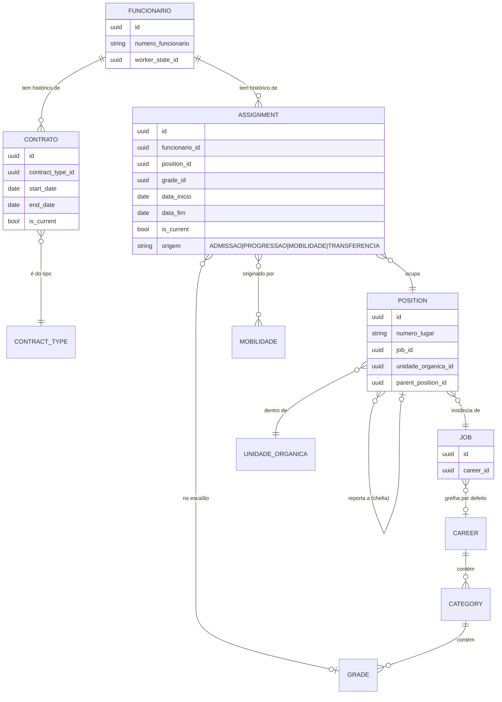

# ADR — Modelo de Movimentos do Colaborador (Enquadramento × Colocação × Mobilidade)

| Metadado | Detalhe |
|---|---|
| **Documento** | ADR — Análise do modelo de movimentos do colaborador |
| **Projeto** | SIPPROG — Sistema de Informação do Pessoal e Progressões |
| **Entidade** | INGT — Instituto Nacional de Gestão do Território |
| **Tipo** | Architecture Decision Record (análise + recomendação) |
| **Estado** | Proposto (aguarda decisão de âmbito) |
| **Data** | 2026-08-29 |
| **Âmbito** | Módulo `colaboradores/` — não altera o `Modelo_Relacional_RH_v4.0.md` |

> Este documento **não substitui** o modelo relacional v4. É uma análise que compara o modelo atual com as boas práticas de HRIS do mercado e recomenda ajustes. A decisão final fica em aberto (ver §7).

---

## 1. Contexto e problema

O módulo tem três "movimentos" do colaborador, em históricos separados (princípio do `MODELO_NEGOCIO.md` §8):

- **Contrato** (`t_contrato`) — vínculo legal.
- **Enquadramento** (`t_employee_professional_assignments`) — posicionamento na grelha PCFR: carreira + categoria + escalão + cargo + função.
- **Colocação** (`t_employee_unit_assignments`) — unidade orgânica onde está.

A separação está **correta** (mudam por motivos diferentes → normalização). Mas a análise ao código revelou **problemas de fronteira**, não de separação:

### Factos verificados no código

1. **Duplicação da unidade e do cargo.** `EnquadramentoEntity` e `ColocacaoEntity` guardam ambos a unidade (`unidade_organica_id` vs `unit_id`) e o cargo (`cargo_id` vs `job_id`), além de timeline própria (`data_inicio/data_fim/is_current` vs `start_date/end_date/is_current`).
   - Refs: `EnquadramentoEntity.java:47-48`, `ColocacaoEntity.java:29-33`.

2. **Drift na mobilidade.** `AprovarLicencaMobilidadeCommandHandler` (mobilidade) só fecha/cria **colocação** (com `cargo=null`); **nunca toca no enquadramento**. Depois de uma mobilidade, o enquadramento continua a apontar para a **unidade antiga**.
   - Ref: `AprovarLicencaMobilidadeCommandHandler.java:49-58`.

3. **Registo completo não cria colocação.** `RegistarColaboradorCommandHandler` cria funcionário + contrato + enquadramento + banco + documentos, mas **não** cria colocação. O colaborador nasce com unidade no enquadramento mas **sem registo de colocação** (ecrã "Sem colocações registadas").
   - Ref: `RegistarColaboradorCommandHandler.java:33-86`.

4. **Progressão não é detetada, só registada.** `Category.ordem_progressao`, `Grade.*`, `VinculoLaboral.eligible_for_progression` existem mas **nenhum handler os consome**. A progressão só existe como a sequência de enquadramentos ordenada por `data_inicio`. Não há motor de elegibilidade (tempo-no-escalão, alertas).

### Diagnóstico

> O problema **não** é os históricos serem separados — é a **fronteira** entre enquadramento e colocação estar mal desenhada (a unidade vive nos dois) e faltar o conceito de **"lugar" (Position)**.

O contrato **não** sofre disto porque não partilha campos com os outros — por isso nunca gera confusão. É o modelo a provar-se: entidades com fronteiras limpas não confundem.

---

## 2. Modelo de referência do mercado

Os grandes HRIS (Oracle Fusion HCM, Workday) separam **quatro** conceitos:

| Conceito | Definição | Chave |
|---|---|---|
| **Job** | Papel **genérico** (ex.: "Técnico Superior"). Sem unidade. Define grade(s) por defeito. | Catálogo |
| **Position** (*Lugar*) | **Instância** de um Job **dentro de uma unidade**. Número único, posição-pai (→ chefia), N lugares. | Catálogo/estrutura |
| **Assignment** | Liga o **trabalhador** a Job/Position ao longo do tempo: job, grade, org, chefia, datas. Efetivo-datado (SCD Type 2). | Histórico |
| **Grade** | Escalão salarial, ligado a Job/Position, escolhido no Assignment. | Catálogo |

Estrutura canónica: **Worker → Work Relationship → Assignment**, onde o *Work Relationship* (≈ contrato/vínculo) é **separado** do *Assignment* (posição/grade/unidade). O *Assignment* é **um** registo versionado — qualquer mudança (unidade, grade, cargo) gera nova versão datada.

**Padrão temporal:** SCD Type 2 (nova linha por mudança, com `start/end date` + flag "atual"). O SIPPROG **já faz isto** (`is_current` + datas) — está correto, manter.

### Duas leituras do mercado, aplicadas ao SIPPROG

- ✅ **Contrato separado** — correto e alinhado (Work Relationship é entidade própria no Oracle/Workday).
- ⚠️ **Enquadramento + Colocação** — o mercado tende a **juntá-los** num Assignment único datado que referencia uma **Position**, em vez de dois históricos que partilham a unidade.
- ❌ **Falta o conceito de Position (Lugar)** — cargo+unidade como entidade com identidade (número, hierarquia, headcount). Resolve "quem é a chefia" e "quantos lugares vagos há" (quadro de pessoal), que a função pública precisa.

---

## 3. Modelo-alvo (diagrama ER conceptual)

**Ideia central:** a "unidade" deixa de estar solta em duas tabelas. Vive na **Position**. O **Assignment** (que funde enquadramento+colocação) aponta para a Position → herda a unidade, o cargo e a chefia **de um só sítio**. Sem duplicação, sem drift.

---

## 4. Mapeamento — modelo atual → modelo-alvo

| Conceito de mercado | Tabela SIPPROG atual | Ação proposta |
|---|---|---|
| **Work Relationship** | `t_contrato` | Manter separado ✅ |
| **Job** | `t_job` (`cargo`) + `t_career`/`t_category` | Manter; Job = papel genérico |
| **Grade** | `t_grade` (escalão) | Manter |
| **Position (Lugar)** | *(não existe)* | **Criar** `t_position` = `job_id` + `unidade_organica_id` + `parent_position_id` + `numero_lugar` |
| **Assignment** | `t_employee_professional_assignments` **+** `t_employee_unit_assignments` | **Fundir** num histórico; referencia Position + Grade |
| Unidade orgânica | `unidade_organica_id` (enquadramento) **e** `unit_id` (colocação) | **Remover** do enquadramento; passa a viver na Position |

---

## 5. Opções de implementação

### Opção A — Passo mínimo (baixo risco)
- **Remover** `unidade_organica_id` do enquadramento; a **colocação** é dona única da unidade.
- "Unidade atual" resolve-se pela colocação corrente (`funcionario_id` + `is_current`).
- No `RegistarColaboradorCommandHandler`, quando há enquadramento, **criar também a colocação inicial** (mesma unidade).
- **Prós:** resolve o drift e o "nasce sem colocação" com pouca disrupção.
- **Contras:** mantém dois históricos; não traz Position/hierarquia/headcount.

### Opção B — Alinhada com o mercado (maior valor, maior esforço)
- Introduzir `t_position` (Lugar).
- Fundir enquadramento+colocação num Assignment datado que aponta para Position + Grade.
- **Prós:** modelo limpo, hierarquia/chefia e quadro de pessoal "de graça", zero duplicação, alinhado Oracle/Workday.
- **Contras:** migração significativa (schema, mappers, DTOs, handlers, seed, controllers gerados via `.igrpstudio/`).

---

## 6. Progressão de carreira (lacuna identificada)

Independente das opções acima. Hoje a progressão é **registada** (novo enquadramento/assignment) mas **não detetada**. Recomenda-se, numa fase própria:
- Uma query que leia o histórico de enquadramentos/assignments e calcule **tempo-no-escalão** e **elegibilidade** (usando `Category.ordem_progressao`, `Grade`, `VinculoLaboral.eligible_for_progression` — hoje dados mortos).
- Alertas de "colaborador elegível para progressão".

---

## 7. Decisão

**Estado: em aberto.** A decidir pelo responsável:

1. **Âmbito:** Opção A (mínima) ou Opção B (Position/Assignment)?
2. **Progressão:** incluir agora um motor de elegibilidade ou adiar?

**Recomendação do autor:** começar pela **Opção A** (corrige já o drift e o registo incompleto, baixo risco) e planear a **Opção B** como evolução v5, com a Position a resolver hierarquia e quadro de pessoal. A progressão fica como fase autónoma.

---

## Fontes (boas práticas de mercado)

- Oracle HCM — "Job" or "Job and Position": https://medium.com/@madan.roopesh23/oracle-hcm-job-or-job-and-position-0dbe86d8c5f3
- How Grades Work with Jobs, Positions, Assignments — Oracle Docs: https://docs.oracle.com/en/cloud/saas/human-resources/25b/faucf/how-grades-and-grade-rates-work-with-jobs-positions-assignments.html
- Jobs and Positions — Oracle Fusion HCM: https://docs.oracle.com/en/cloud/saas/human-resources/21c/faigh/jobs-and-positions.html
- Assignments — Oracle Fusion HCM: https://docs.oracle.com/en/cloud/saas/human-resources/fawhr/assignments.html
- Job vs Position Management: https://help.scalis.ai/difference-between-job-management-and-position-management
- Slowly Changing Dimensions Type 2: https://www.analyticsengineering.com/resources/slowly-changing-dimensions-type-2-explained
