# Modelo Relacional — Módulo RH (Dossier do Funcionário)

| Metadado | Detalhe |
|---|---|
| **Documento** | Modelo Relacional RH v4.0 |
| **Projeto** | SIPPROG — Sistema de Informação do Pessoal e Progressões |
| **Entidade** | INGT — Instituto Nacional de Gestão do Território |
| **Versão** | 4.6 |
| **Data** | Junho 2026 |
| **Status** | Em curso |

---

## Índice

1. [Visão Geral](#1-visão-geral)
2. [Princípios de Design](#2-princípios-de-design)
3. [Modelo por Bloco](#3-modelo-por-bloco)
4. [Diagrama de Relacionamentos](#4-diagrama-de-relacionamentos)
5. [Regras de Negócio no Modelo](#5-regras-de-negócio-no-modelo)
6. [O que vai para OptionEntity](#6-o-que-vai-para-optionentity)
7. [Comparação com Modelo Anterior](#7-comparação-com-modelo-anterior)

---

## 1. Visão Geral

O modelo relacional do Módulo RH organiza-se em **10 blocos funcionais** e **30 tabelas** (29 RH + 1 IAM em shared/), cobrindo o ciclo completo do dossier do funcionário público: desde a identificação pessoal, passando pelo historial profissional (contrato, enquadramento de carreira, colocação), até aos documentos, ausências e licenças.

A filosofia central é a separação clara de responsabilidades:

- **Dados pessoais** ficam em `t_funcionario`
- **Historial de contrato** fica em `t_contrato` com o seu próprio ciclo de vida
- **Historial de enquadramento** (carreira + categoria + escalão + cargo + função) fica em `t_employee_professional_assignments`
- **Historial de colocação** (onde o funcionário está) fica em `t_employee_unit_assignments`
- **Documentos** (ficheiros físicos/digitais) ficam numa tabela genérica `t_document`
- **Lookups simples** (estados civis, sexo, ilhas) ficam em `t_option_entity`
- **Parametrizações com comportamento** (tipos de ausência, subtipos de licença, tipos de contrato) ficam em tabelas próprias

---

## 2. Princípios de Design

### 2.1 OptionEntity — Lookups Genéricos

O `t_option_entity` é uma tabela chave-valor que serve como catálogo genérico para todos os lookups que são **apenas labels sem lógica de negócio associada**. A sua estrutura:

```
option_entity
  ccode       → categoria do grupo   (ex: 'MARITAL_STATUS')
  ckey        → chave da opção       (ex: 'SOLTEIRO')
  cvalue      → label de exibição    (ex: 'Solteiro(a)')
  locale      → idioma               (ex: 'pt-CV')
  sort_order  → ordem de exibição
  active      → estado lógico
  description → descrição opcional
```

**Regra de uso:** Se o catálogo tem campos que alteram o comportamento do sistema (flags booleanos, limites numéricos, relações entre si), usa uma **tabela dedicada**. Se é apenas um label configurável pelo administrador, vai para `t_option_entity`.

### 2.2 Históricos Independentes — O Padrão is_current

O dossier do funcionário tem **três dimensões de historial independentes**, cada uma com o seu próprio ciclo de vida:

| Historial | Tabela | Marcador de actual |
|---|---|---|
| Contrato | `t_contrato` | `is_current = true` |
| Enquadramento profissional | `t_employee_professional_assignments` | `is_current = true` |
| Colocação / Unidade | `t_employee_unit_assignments` | `is_current = true` |

São independentes porque mudam por razões diferentes:
- O **contrato** muda quando há renovação ou mudança de vínculo (CTFP → Nomeação Definitiva)
- O **enquadramento** muda quando há promoção, progressão ou mudança de cargo
- A **colocação** muda quando há mobilidade para outra unidade

Quando um histórico muda, o registo anterior fecha (`end_date` preenchido, `is_current = false`) e cria-se um novo (`is_current = true`). Apenas **um registo activo** por funcionário em cada dimensão.

### 2.3 Referências a OptionEntity — Valores String (sem FK)

Os campos que referenciam um registo de `t_option_entity` **não guardam o UUID** da linha. Guardam directamente o `ckey` como `VARCHAR`. Exemplos:

```
sex             VARCHAR(10)   → 'M', 'F'
marital_status  VARCHAR(30)   → 'SOLTEIRO', 'CASADO', 'VIUVO'
level           VARCHAR(50)   → 'LICENCIATURA', 'MESTRADO'
training_type   VARCHAR(50)   → 'PRESENCIAL', 'ELEARNING'
```

**Razão:** o `ckey` é estável e legível; um UUID exige JOIN para qualquer leitura do valor. A validação (verificar que o ckey existe no ccode correcto) é responsabilidade da camada aplicacional — um método reutilizável `OptionValidator.validate(ccode, ckey)` será aplicado em todos os handlers que recebem campos deste tipo.

**Convenção de nomeação nas tabelas:**

| ccode | Nome do campo na tabela | Tipo |
|---|---|---|
| `SEX` | `sex` | `VARCHAR(10)` |
| `MARITAL_STATUS` | `marital_status` | `VARCHAR(30)` |
| `NATIONALITY` | `nationality` / `country` | `VARCHAR(10)` |
| `ISLAND` | `address_island` | `VARCHAR(50)` |
| `CONCELHO` | `address_concelho` | `VARCHAR(50)` |
| `RELATIONSHIP_TYPE` | `relationship_type` | `VARCHAR(50)` |
| `QUALIFICATION_LEVEL` | `level` | `VARCHAR(50)` |
| `TRAINING_TYPE` | `training_type` | `VARCHAR(50)` |
| `LEAVE_CATEGORY` | `category` | `VARCHAR(50)` |
| `DOC_CATEGORY` | `category` | `VARCHAR(50)` |

Os ccodes exactos de cada campo serão documentados na secção 6.

### 2.4 Documentos Polimórficos

A tabela `t_document` é genérica e pode associar-se a qualquer entidade do sistema através dos campos:

```
reference_entity  → nome da tabela de origem  (ex: 't_leave_request')
reference_id      → ID do registo associado    (ex: 42)
```

Isto permite que um documento seja o justificativo de uma ausência, o certificado de uma formação, ou o processo disciplinar, sem criar tabelas de documentos separadas para cada entidade.

### 2.5 Soft Delete e Auditoria

- Nenhuma tabela usa `DELETE` físico. O soft delete é feito por `is_active = false`
- Todas as tabelas de negócio têm colunas de auditoria: `created_at`, `created_by`, `updated_at`, `updated_by`
- Alterações são registadas em `change_history` via trigger `fn_audit_generic`

---

## 3. Modelo por Bloco

---

### Bloco 0 — OptionEntity (Tabela de Opções Genéricas)

```
t_option_entity  (Opções / Lookups Genéricos)
├── id           UUID          PK
├── ccode        VARCHAR(50)   NOT NULL    -- categoria: 'MARITAL_STATUS', 'SEX', ...
├── ckey         VARCHAR(50)              -- chave: 'SOLTEIRO', 'M', ...
├── cvalue       VARCHAR(200)             -- label: 'Solteiro(a)', 'Masculino', ...
├── locale       VARCHAR(10)              -- 'pt-CV', 'en'
├── sort_order   INTEGER                  -- ordem de exibição
├── active       BOOLEAN       DEFAULT TRUE
└── description  TEXT
```

**Categorias cobertas por `t_option_entity`:**

| ccode | Descrição | Exemplos de ckey |
|---|---|---|
| `MARITAL_STATUS` | Estado Civil | `SOLTEIRO`, `CASADO`, `UNIAO_FACTO`, `DIVORCIADO`, `VIUVO` |
| `SEX` | Sexo | `M`, `F` |
| `NATIONALITY` | Nacionalidade | `CV`, `PT`, `SN`, `BR`, ... |
| `UNIT_TYPE` | Tipo de Unidade Orgânica | `DIRECAO`, `DEPARTAMENTO`, `DIVISAO`, `SECCAO` |
| `DOC_CATEGORY` | Categoria de Documento | `PESSOAL`, `CONTRATUAL`, `FORMACAO`, `DISCIPLINAR`, `AVALIACAO` |
| `LEAVE_CATEGORY` | Categoria de Ausência | `FERIAS`, `DOENCA`, `FAMILIA`, `OUTRO` |
| `QUALIFICATION_LEVEL` | Nível de Habilitação Literária | `BASICO`, `SECUNDARIO`, `LICENCIATURA`, `MESTRADO`, `DOUTORAMENTO` |
| `RELATIONSHIP_TYPE` | Tipo de Parentesco (dependentes) | `CONJUGE`, `FILHO`, `PAI`, `MAE`, `IRMAO` |
| `ISLAND` | Ilha de Cabo Verde | `SANTIAGO`, `SAL`, `BOA_VISTA`, `SAO_VICENTE`, `FOGO` |
| `CONCELHO` | Concelho | `PRAIA`, `SANTA_CATARINA`, `SAO_DOMINGOS`, `MINDELO` |
| `TRAINING_TYPE` | Tipo de Formação | `PRESENCIAL`, `ELEARNING`, `SEMINARIO`, `CONGRESSO` |
| `CAREER_REGIME` | Regime da Carreira (PCFR) | `GERAL`, `ESPECIAL` |
| `BANCO` | Banco (para dados bancários) | `BCA`, `BCN`, `CECV`, `BAI` |
| `WORK_REGIME` | Regime de Trabalho (LGTFP art.123-129) | `TEMPO_COMPLETO`, `TEMPO_PARCIAL`, `ISENCAO_HORARIO`, `DEDICACAO_EXCLUSIVA` |
| `WORKER_STATE_REASON` | Motivo de Mudança de Estado do Colaborador | `DISCIPLINARY_SUSPENSION`, `MEDICAL_SUSPENSION`, `OWN_REQUEST_SUSPENSION`, `AGE_RETIREMENT`, `DISABILITY_RETIREMENT`, `VOLUNTARY_RETIREMENT`, `CONTRACT_TERMINATION`, `MUTUAL_AGREEMENT`, `DISCIPLINARY_DISMISSAL`, `DEATH`, `SUSPENSION_RETURN`, `REINTEGRATION` |
| `RECORD_TYPE` | Tipo de Registo de Licença/Mobilidade | `LICENCA`, `MOBILIDADE`, `AMBOS` |

---

### Bloco 1 — Parametrizações com Comportamento

Tabelas dedicadas porque os seus campos **alteram o comportamento do sistema**. Não podem estar em `t_option_entity`.

```
t_worker_state  (Estados do Trabalhador)
├── id         UUID      PK
├── code       VARCHAR(30)  UNIQUE NOT NULL    -- ACTIVE, INACTIVE, SUSPENDED
├── description TEXT
├── is_core    BOOLEAN      DEFAULT FALSE      -- TRUE = não pode ser desactivado
└── is_active  BOOLEAN      DEFAULT TRUE

-- Razão de tabela dedicada: is_core impede desactivação de estados núcleo do sistema.
-- Colaboradores INACTIVE não podem aceder à área reservada (/me/*).
```

```
t_vinculo_laboral  (Vínculos Laborais)
├── id                       UUID      PK
├── code                     VARCHAR(30)  UNIQUE NOT NULL    -- EFETIVO, CONTRATADO, COMISSIONADO, ESTAGIARIO
├── description              TEXT                            -- designação do vínculo
├── counts_seniority         BOOLEAN NOT NULL DEFAULT TRUE   -- conta para antiguidade e progressão (PCFR)
├── eligible_for_progression BOOLEAN NOT NULL DEFAULT TRUE   -- elegível para progressão na carreira (PCFR)
└── is_active                BOOLEAN      DEFAULT TRUE

-- Razão de tabela dedicada: EFETIVO vs CONTRATADO têm regras distintas no PCFR
-- (antiguidade, progressão, direitos). O código é referenciado por lógica de negócio.
-- counts_seniority e eligible_for_progression são usados nos cálculos de progressão.
-- Referenciado por t_contract_type.vinculo_laboral_id (parametrizável pelo administrador RH).
```

```
t_contract_type  (Tipos de Contrato)
├── id                          UUID      PK
├── code                        VARCHAR(50)  UNIQUE NOT NULL
│                               -- NOMEACAO_DEFINITIVA, CFP, CTFP_TERMO_CERTO, CTFP_TERMO_INCERTO, COMISSAO_SERVICO
├── name                        VARCHAR(150) NOT NULL
├── description                 TEXT
├── vinculo_laboral_id          UUID FK→t_vinculo_laboral  -- vínculo laboral que este tipo de contrato implica (LGTFP)
├── is_renewable                BOOLEAN NOT NULL DEFAULT FALSE    -- CTFP a termo certo é renovável; Nomeação Definitiva não
├── max_renewals                INTEGER                           -- nº máximo de renovações permitidas por lei (null = sem limite)
├── max_duration_months         INTEGER                           -- duração máxima legal em meses (null = indefinido)
├── requires_career_structure   BOOLEAN      DEFAULT FALSE        -- true = obriga career/category/grade no enquadramento
└── is_active                   BOOLEAN      DEFAULT TRUE

-- Razão de tabela dedicada: tem historial próprio em t_contrato.
-- Cada tipo tem implicações legais distintas (renovabilidade, prazo, direitos).
-- vinculo_laboral_id: classifica o vínculo laboral que o tipo de contrato implica (base: LGTFP).
--   Parametrizável pelo administrador RH — não actualiza nenhum campo em t_funcionario.
-- is_renewable / max_renewals / max_duration_months: permitem ao sistema alertar quando
--   os limites legais de renovação ou duração se aproximam (base: LGTFP art. CTFP). Ver `t_contract_type.max_renewals`.
```

```
t_tipo_documento  (Tipos de Documento)
├── id                   UUID      PK
├── code                 VARCHAR(30)  UNIQUE NOT NULL
│                        -- CNI, PASSAPORTE, CONTRATO, CERTIDAO, HABILITACAO,
│                        -- FORMACAO, DISCIPLINAR, RECIBO, JUSTIFICATIVO, OUTRO
├── name                 VARCHAR(100) NOT NULL
├── category             VARCHAR(50)                -- ccode='DOC_CATEGORY'; ckey: PESSOAL, CONTRATUAL, FORMACAO, DISCIPLINAR, AVALIACAO
├── allowed_extensions   VARCHAR(200)               -- ex: 'pdf,jpg,png'
└── is_active            BOOLEAN DEFAULT TRUE

-- Razão de tabela dedicada: allowed_extensions determina validação no upload.
-- category agrupa tipos por secção do dossier (valor string ckey, sem FK UUID).
```

```
t_leave_type  (Tipos de Ausência)
├── id                   UUID      PK
├── code                 VARCHAR(30)  UNIQUE NOT NULL
│                        -- FERIAS, DOENCA, MATERNIDADE, PATERNIDADE, LUTO, CASAMENTO
├── name                 VARCHAR(100) NOT NULL
├── category             VARCHAR(50)                     -- ccode='LEAVE_CATEGORY'; ckey: FERIAS, DOENCA, FAMILIA, OUTRO
├── deducts_balance      BOOLEAN NOT NULL DEFAULT TRUE   -- desconta saldo anual
├── requires_approval    BOOLEAN NOT NULL DEFAULT TRUE   -- exige aprovação da chefia
├── max_days_per_year    INTEGER                         -- null = sem limite legal
├── is_active            BOOLEAN DEFAULT TRUE
└── auditoria            created_at/by, updated_at/by

-- Razão de tabela dedicada: deducts_balance e requires_approval alteram
-- completamente o fluxo de processamento do pedido de ausência.
-- category é valor string ckey, sem FK UUID para option_entity.
```

```
t_leave_mobility_subtype  (Subtipos de Licença e Mobilidade)
├── id                    UUID      PK
├── code                  VARCHAR(50)  UNIQUE NOT NULL
├── name                  VARCHAR(150) NOT NULL
├── record_type           VARCHAR(20)  NOT NULL       -- ccode='RECORD_TYPE'; ckey: LICENCA, MOBILIDADE, AMBOS
├── affects_pay           BOOLEAN NOT NULL DEFAULT FALSE     -- afecta remuneração
├── counts_for_seniority  BOOLEAN NOT NULL DEFAULT TRUE      -- conta para antiguidade
├── can_self_submit       BOOLEAN NOT NULL DEFAULT FALSE     -- colaborador pode submeter
└── is_active             BOOLEAN DEFAULT TRUE

-- Razão de tabela dedicada: affects_pay e counts_for_seniority têm impacto
-- no processamento salarial e cálculo de antiguidade.
-- can_self_submit altera quem pode iniciar o processo.
```

---

### Bloco 2 — Estrutura Organizacional

```
t_unidade_organica  (Unidades Orgânicas)
├── id                    UUID      PK
├── code                  VARCHAR(50)  UNIQUE NOT NULL
├── name                  VARCHAR(150) NOT NULL
├── acronym               VARCHAR(20)
├── type                  VARCHAR(100)                 -- ex: DIRECAO, DEPARTAMENTO, DIVISAO, SECCAO
├── descricao             TEXT
├── estado                BOOLEAN
├── parent_unit_id        UUID FK→t_unidade_organica  -- null = raiz da hierarquia
├── is_active             BOOLEAN DEFAULT TRUE
└── auditoria

-- Auto-referência para modelar a hierarquia: Direcção > Departamento > Divisão > Secção.
-- A raiz tem parent_unit_id = NULL.
```

```
t_job  (Cargos)
├── id          UUID      PK
├── code        VARCHAR(50)  UNIQUE NOT NULL
├── name        VARCHAR(150) NOT NULL
├── description TEXT
├── nivel       INTEGER
├── is_active   BOOLEAN      DEFAULT TRUE
└── auditoria
```

```
t_funcao  (Funções)
├── id          UUID      PK
├── code        VARCHAR(50)  UNIQUE NOT NULL
├── name        VARCHAR(150) NOT NULL
├── description TEXT
├── job_id      UUID      FK→t_job   -- cargo ao qual a função pertence (nullable = função genérica)
├── is_active   BOOLEAN      DEFAULT TRUE
└── auditoria

-- job_id nullable: permite funções genéricas não ligadas a nenhum cargo específico.
-- Semântica de herança: um funcionário com um cargo herda todas as funções onde job_id = cargo_id.
--   Isso significa que PODE exercer qualquer uma delas. O function_id no enquadramento
--   regista QUAL está efectivamente a exercer naquele período (opcional — não todos os
--   funcionários têm função específica registada).
-- Validação de domínio: ao criar um enquadramento com cargo + função, a aplicação
--   verifica que função.job_id == cargo_id (ou que job_id é null). Rejeita com HTTP 422 se incompatível.
-- Filtro de API: GET /estrutura/functions?jobId={cargoId} devolve as funções do cargo.
```

---

### Bloco 3 — Carreiras e Progressão

A hierarquia `careers → categories → grades` modela a grelha do PCFR (Plano de Carreiras, Funções e Remunerações, Decreto-Lei 4/2024).

```
t_career  (Carreiras)
├── id                 UUID      PK
├── code               VARCHAR(50)  UNIQUE NOT NULL
├── name               VARCHAR(150) NOT NULL
├── description        TEXT
├── regime             VARCHAR(100)              -- ex: GERAL, ESPECIAL (valor direto, sem FK)
├── is_active          BOOLEAN      DEFAULT TRUE
└── auditoria
```

```
t_category  (Categorias)
├── id                UUID      PK
├── career_id         UUID NOT NULL FK→t_career
├── code              VARCHAR(50)  NOT NULL
├── name              VARCHAR(150) NOT NULL
├── description       TEXT
├── ordem_progressao  INTEGER                  -- ordem de progressão dentro da carreira (1, 2, 3, ...)
├── is_active         BOOLEAN      DEFAULT TRUE
├── auditoria
└── UQ (career_id, code)    -- código único dentro da mesma carreira
```

```
t_grade  (Escalões)
├── id            UUID      PK
├── category_id   UUID NOT NULL FK→t_category
├── grade_number  INTEGER      NOT NULL        -- número do escalão (1, 2, 3, ...)
├── codigo        VARCHAR(50)                  -- código alfanumérico do escalão
├── name          VARCHAR(150) NOT NULL
├── salary_index  NUMERIC(12,2)                -- índice salarial da grelha PCFR
├── salary_base   NUMERIC(12,2)                -- salário base em CVE correspondente ao índice
├── is_active     BOOLEAN      DEFAULT TRUE
└── UQ (category_id, grade_number)             -- escalão único dentro da categoria
```

---

### Bloco 4 — Núcleo do Funcionário

```
t_funcionario  (Funcionários)
├── id                           UUID          PK
├── numero_funcionario           VARCHAR(10)   UNIQUE NOT NULL  -- ex: 'F000001'; gerado por seq_numero_funcionario; imutável após criação
├── nome_completo                VARCHAR(200)  NOT NULL
├── data_nascimento              DATE          NOT NULL
├── genero                       VARCHAR(50)   NOT NULL          -- valor livre (ex: 'Masculino', 'Feminino')
├── estado_civil                 VARCHAR(50)   NOT NULL          -- valor livre (ex: 'Solteiro', 'Casado')
├── nif                          VARCHAR(20)   UNIQUE NOT NULL
├── document_type_id             UUID          FK→t_tipo_documento               -- tipo do documento de identificação (nullable)
├── numero_documento             VARCHAR(50)   UNIQUE                           -- nº do BI/Passaporte/outro; único quando preenchido
├── data_emissao_doc             DATE                                            -- data de emissão do documento
├── data_validade_doc            DATE                                            -- data de validade do documento
├── nacionalidade                VARCHAR(50)   NOT NULL  DEFAULT 'CV'
├── worker_state_id              UUID          FK→t_worker_state  -- atribuído ATIVO por defeito na criação; set pelo CreateFuncionarioCommandHandler
├── data_admissao                DATE          NOT NULL
├── email                        VARCHAR(200)  UNIQUE
├── telefone                     VARCHAR(30)
├── morada                       TEXT
├── ilha                         VARCHAR(100)                                    -- valor livre
├── concelho                     VARCHAR(100)                                    -- valor livre
├── localidade                   VARCHAR(100)
├── is_active                    BOOLEAN       NOT NULL  DEFAULT TRUE
└── auditoria
```

```
t_dependente  (Dependentes do Funcionário)
├── id                   UUID      PK
├── funcionario_id       UUID NOT NULL FK→t_funcionario
├── full_name            VARCHAR(200) NOT NULL
├── birth_date           DATE
├── relationship_type    VARCHAR(50)               -- ccode='RELATIONSHIP_TYPE'; ckey: CONJUGE, FILHO, PAI, MAE, IRMAO
├── nif                  VARCHAR(20)
├── is_active            BOOLEAN NOT NULL
└── auditoria

-- Cônjuge, filhos e outros dependentes para efeitos de INPS e subsídios familiares.
-- relationship_type é valor string ckey, sem FK UUID para option_entity.
```

```
t_dados_bancarios  (Dados Bancários do Funcionário)
├── id                       UUID      PK
├── funcionario_id           UUID NOT NULL FK→t_funcionario
├── banco                    VARCHAR(50)               -- ckey option_entity ccode=BANCO
├── numero_conta             VARCHAR(50)
├── iban                     VARCHAR(34)               -- IBAN/NIB; formato CV exige 25 chars
├── numero_seguranca_social  VARCHAR(30)               -- Nº INPS (Instituto Nacional de Previdência Social)
├── is_active                BOOLEAN NOT NULL
└── auditoria

-- Dados para processamento de vencimento e declarações INPS.
-- Um funcionário pode ter vários registos (conta principal + poupança).
-- banco: ckey da option_entity (ccode=BANCO) — lista de bancos configurável pelo administrador.
-- is_active: soft delete; apenas registos activos são considerados no pagamento.
```

---

### Bloco 5 — Historial Profissional

Os três históricos independentes que compõem o enquadramento completo do funcionário.

```
t_contrato  (Contratos do Funcionário)
├── id                   UUID      PK
├── funcionario_id       UUID NOT NULL FK→t_funcionario
├── contract_type_id     UUID NOT NULL FK→t_contract_type
├── contract_number      VARCHAR(100) UNIQUE              -- nº do instrumento contratual (ex: CTFP); distinto do despacho
├── start_date           DATE  NOT NULL
├── end_date             DATE                             -- null = contrato activo
├── termination_reason   VARCHAR(50)                      -- preenchido quando encerrado; ex: SUBSTITUICAO, CADUCIDADE
├── is_current           BOOLEAN NOT NULL                 -- apenas 1 TRUE por funcionário
├── status               VARCHAR(20) NOT NULL             -- ATIVO | SUSPENSO | CESSADO (controlado pelo sistema)
├── renewal_count        INTEGER NOT NULL                 -- nº de renovações consecutivas do mesmo tipo renovável
├── regime_trabalho      VARCHAR(30)                      -- TEMPO_COMPLETO | TEMPO_PARCIAL | ISENCAO_HORARIO | DEDICACAO_EXCLUSIVA
├── percentagem_tempo    NUMERIC(5,2)                     -- preenchido apenas se regime_trabalho = TEMPO_PARCIAL (ex: 50.00)
├── legal_base           VARCHAR(200)                     -- nº despacho / Boletim Oficial que autoriza o contrato
├── notes                TEXT
└── auditoria

-- Historial independente do enquadramento de carreira.
-- Muda quando: renovação de CTFP, mudança para nomeação definitiva, comissão de serviço.
-- NÃO muda quando: promoção de escalão (isso é t_enquadramento).
-- status: controlado exclusivamente pela aplicação — não é configurável pelo utilizador.
--   ATIVO → estado inicial; SUSPENSO → durante licença sem vencimento; CESSADO → encerrado.
--   Ao criar novo contrato, o anterior passa a CESSADO + is_current = false (lógica no handler).
-- renewal_count: incrementado quando o novo contrato é do mesmo tipo renovável que o anterior.
--   Permite ao sistema alertar quando o limite legal (contract_types.max_renewals) é atingido.
-- regime_trabalho: ckey validado pelo enum RegimeTrabalho (base legal: LGTFP art. 123-129).
--   Nullable — campo obrigatório apenas quando relevante para o tipo de contrato.
-- percentagem_tempo: obrigatório quando regime_trabalho = TEMPO_PARCIAL; proibido nos restantes.
-- contract_number: nullable — Nomeação Definitiva e Comissão de Serviço usam apenas legal_base.
-- termination_reason: motivo de cessação (base LGTFP); determina direitos do funcionário.
-- Documentos associados: ligados via documents(reference_entity='t_contrato', reference_id).
```

```
t_employee_professional_assignments  (Enquadramento Profissional)
├── id                  UUID      PK
├── funcionario_id      UUID NOT NULL FK→t_funcionario
├── career_id           UUID FK→t_career              -- nullable: só obrigatório se contractType.requires_career_structure = true
├── category_id         UUID FK→t_category            -- nullable: idem
├── grade_id            UUID FK→t_grade               -- nullable: idem
├── cargo_id            UUID NOT NULL FK→t_job        -- sempre obrigatório
├── function_id         UUID FK→t_funcao              -- nullable: função específica que exerce neste período
├── unidade_organica_id UUID NOT NULL FK→t_unidade_organica
├── data_inicio         DATE  NOT NULL
├── data_fim            DATE                           -- null = enquadramento actual
├── is_current          BOOLEAN NOT NULL               -- apenas 1 TRUE por funcionário
└── auditoria

-- Historial de progressão na estrutura orgânica e de carreira.
-- Muda quando: promoção de categoria, progressão de escalão, mudança de cargo/função/unidade.
-- NÃO muda quando: renovação de contrato (isso é t_contrato).
-- Regras cruzadas com t_contrato:
--   1. Criação exige contrato ATIVO; data_inicio dentro do período do contrato.
--   2. requires_career_structure = true → career_id, category_id, grade_id obrigatórios.
--   3. Cessação do contrato encerra automaticamente o enquadramento activo.
-- function_id vs herança de funções do cargo:
--   O funcionário herda todas as funções do seu cargo (t_funcao WHERE job_id = cargo_id).
--   O function_id não duplica essa relação — regista qual função específica está a exercer
--   naquele período. Necessário para despachos oficiais, historial e relatórios RH.
--   É opcional: funcionários sem função específica atribuída deixam este campo a null.
```

```
t_employee_unit_assignments  (Colocações / Mobilidade)
├── id                   UUID      PK
├── funcionario_id       UUID NOT NULL FK→t_funcionario
├── unit_id              UUID FK→t_unidade_organica
├── job_id               UUID FK→t_job              -- cargo na unidade de destino (opcional)
├── start_date           DATE  NOT NULL
├── end_date             DATE                        -- null = colocação actual
├── is_current           BOOLEAN NOT NULL            -- TRUE = colocação principal activa
├── is_active            BOOLEAN NOT NULL
├── assignment_type      VARCHAR(50) NOT NULL        -- tipo de atribuição
├── notes                TEXT
└── auditoria

-- Historial de onde o funcionário está colocado.
-- Muda quando: mobilidade interna, destacamento, cedência.
-- is_current = TRUE marca a colocação activa principal.
```

**Leitura do estado completo actual de um funcionário:**

```sql
SELECT
    f.*,
    ws.code          AS worker_state_code,
    ct.code          AS contract_type_code,
    ec.start_date    AS contract_start,
    c.name           AS career,
    cat.name         AS category,
    g.grade_number   AS grade,
    g.salary_index,
    j.name           AS job,
    func.name        AS function_name,
    ou.name          AS unit
FROM t_funcionario f
LEFT JOIN t_worker_state ws              ON ws.id = f.worker_state_id
LEFT JOIN t_contrato ec                  ON ec.funcionario_id = f.id AND ec.is_current = true
LEFT JOIN t_contract_type ct             ON ct.id = ec.contract_type_id
LEFT JOIN t_employee_professional_assignments epa
                                         ON epa.funcionario_id = f.id AND epa.is_current = true
LEFT JOIN t_career c     ON c.id   = epa.career_id
LEFT JOIN t_category cat ON cat.id = epa.category_id
LEFT JOIN t_grade g      ON g.id   = epa.grade_id
LEFT JOIN t_job j        ON j.id   = epa.cargo_id
LEFT JOIN t_funcao func  ON func.id = epa.function_id
LEFT JOIN t_employee_unit_assignments eua
                                         ON eua.funcionario_id = f.id AND eua.is_current = true AND eua.end_date IS NULL
LEFT JOIN t_unidade_organica ou          ON ou.id = eua.unidade_organica_id
WHERE f.id = :funcionarioId;
```

---

### Bloco 6 — Dossier: Formação e Disciplinar

```
t_qualificacao  (Habilitações Literárias)
├── id            UUID      PK
├── funcionario_id UUID NOT NULL FK→t_funcionario
├── level         VARCHAR(50)               -- ccode='QUALIFICATION_LEVEL'; ckey: BASICO, SECUNDARIO, LICENCIATURA, MESTRADO, DOUTORAMENTO
├── course_name   VARCHAR(200)             -- designação do curso / área de estudo
├── institution   VARCHAR(200)             -- instituição de ensino
├── country       VARCHAR(10)              -- ccode='NATIONALITY'; ckey: CV, PT, ... (país da instituição)
├── start_date    DATE                     -- início do curso
├── end_date      DATE                     -- conclusão do curso
├── completed     BOOLEAN NOT NULL DEFAULT FALSE   -- TRUE = concluído com certificado
└── auditoria

-- level e country são valores string ckey, sem FK UUID para option_entity.
-- completed + end_date permitem registar formações em curso (completed=false, end_date=null).
-- Documentos associados (diploma, certificado) ligados via documents(reference_entity='t_qualificacao', reference_id=id).
```

```
t_training  (Formações Profissionais)
├── id              UUID      PK
├── funcionario_id   UUID NOT NULL FK→t_funcionario
├── name            VARCHAR(200) NOT NULL    -- designação da formação
├── institution     VARCHAR(200)             -- entidade formadora
├── training_type   VARCHAR(50)              -- ccode='TRAINING_TYPE'; ckey: PRESENCIAL, ELEARNING, SEMINARIO, CONGRESSO
├── start_date      DATE
├── end_date        DATE
├── duration_hours  INTEGER                  -- duração em horas
└── auditoria

-- training_type é valor string ckey, sem FK UUID para option_entity.
-- Documentos associados (certificado de participação) ligados via documents(reference_entity='t_training', reference_id=id).
```

```
t_disciplinary_process  (Processos Disciplinares)
├── id                   UUID      PK
├── employee_id          UUID NOT NULL FK→t_funcionario
├── process_number       VARCHAR(50)
├── start_date           DATE NOT NULL
├── end_date             DATE
├── penalty              VARCHAR(200)        -- pena aplicada (repreensão, suspensão, ...)
├── penalty_start_date   DATE
├── penalty_end_date     DATE
├── official_bulletin    VARCHAR(100)        -- nº Boletim Oficial
├── notes                TEXT
└── auditoria

-- Documentos associados (processo digitalizado) ligados via documents(reference_entity='t_disciplinary_process', reference_id=id).
```

---

### Bloco 7 — Documentos

```
t_document  (Documentos do Dossier)
├── id                UUID      PK
├── document_type_id  UUID NOT NULL FK→t_tipo_documento
├── original_filename VARCHAR(255) NOT NULL             -- nome original do ficheiro
├── file_key          VARCHAR(500) NOT NULL             -- chave no MinIO/S3
├── content_type      VARCHAR(100) NOT NULL             -- application/pdf, image/jpeg, ...
├── file_size         BIGINT       NOT NULL
├── description       TEXT
├── reference_entity  VARCHAR(50)  NOT NULL  -- 't_leave_request', 't_training', 't_disciplinary_process', 't_qualificacao', ...
├── reference_id      UUID         NOT NULL  -- ID do registo associado (polimorfismo controlado)
├── is_active         BOOLEAN DEFAULT TRUE
└── auditoria

-- Tabela genérica para todos os ficheiros do sistema.
-- reference_entity + reference_id associam o documento ao registo de origem.
```

---

### Bloco 8 — Ausências, Licenças e Recibos

```
t_leave_balance  (Saldos de Ausência)
├── id              UUID      PK
├── funcionario_id   UUID NOT NULL FK→t_funcionario
├── tipo_ausencia_id UUID NOT NULL FK→t_leave_type
├── ano             INTEGER      NOT NULL
├── dias_direito    INTEGER      NOT NULL          -- dias anuais de direito (inteiro, não decimal)
├── dias_gozados    INTEGER      NOT NULL DEFAULT 0 -- dias já gozados (aprovados e consumidos)
├── dias_pendentes  INTEGER      NOT NULL DEFAULT 0 -- dias em pedidos PENDING (reservados mas não aprovados)
├── auditoria
└── UQ (funcionario_id, tipo_ausencia_id, ano)   -- um saldo por funcionário/tipo/ano

-- dias_disponiveis = dias_direito - dias_gozados - dias_pendentes (campo calculado, não persistido).
```

```
t_leave_request  (Pedidos de Ausência)
├── id                  UUID      PK
├── funcionario_id       UUID NOT NULL FK→t_funcionario
├── tipo_ausencia_id    UUID NOT NULL FK→t_leave_type
├── data_inicio         DATE NOT NULL
├── data_fim            DATE NOT NULL
├── numero_dias         INTEGER NOT NULL                  -- dias úteis do pedido (inteiro, não decimal)
├── motivo              TEXT                              -- justificação do pedido
├── estado              VARCHAR(20)  NOT NULL             -- PENDENTE, APROVADO, REJEITADO, CANCELADO
├── aprovado_por        UUID                              -- UUID do aprovador (sem FK rígida)
├── data_decisao        DATE                              -- data em que a chefia decidiu
├── observacoes_decisao TEXT                              -- notas da chefia na aprovação/rejeição
├── is_active           BOOLEAN NOT NULL DEFAULT TRUE     -- soft delete
└── auditoria

-- Campos renomeados face ao modelo anterior: leave_type_id → tipo_ausencia_id,
--   working_days (NUMERIC) → numero_dias (INTEGER), justification → motivo,
--   status → estado, approver_id → aprovado_por.
-- document_id removido: documentos justificativos são ligados via t_document(reference_entity='t_leave_request').
-- aprovado_por: UUID livre (sem FK rígida para t_funcionario) — permite identificar aprovadores externos.
```

```
t_leave_mobility  (Licenças e Mobilidades)
├── id                     UUID      PK
├── funcionario_id          UUID NOT NULL FK→t_funcionario
├── subtipo_id             UUID NOT NULL FK→t_leave_mobility_subtype
├── destination_unit_id    UUID FK→t_unidade_organica   -- destino (se mobilidade)
├── data_inicio            DATE NOT NULL
├── data_fim               DATE
├── status                 VARCHAR(20) NOT NULL             -- PENDING, ACTIVE, CLOSED
├── observacoes            TEXT                              -- notas gerais
├── entidade_destino       VARCHAR(200)                     -- nome da entidade externa de destino (mobilidade inter-institucional)
├── despacho_numero        VARCHAR(100)                     -- nº do despacho de autorização
├── justification          TEXT                              -- justificação do pedido
├── rejection_reason       TEXT                              -- motivo da rejeição (preenchido pelo aprovador)
├── document_id            UUID FK→t_document              -- documento principal associado
├── is_active              BOOLEAN NOT NULL DEFAULT TRUE    -- soft delete
└── auditoria

-- Campos renomeados: employee_id → funcionario_id, subtype_id → subtipo_id,
--   start_date → data_inicio, end_date → data_fim, notes → observacoes.
-- Novos campos: entidade_destino, despacho_numero, justification, rejection_reason, is_active.
-- document_id mantém FK directa (ao contrário de t_leave_request que usa padrão polimórfico).
```

```
t_payroll_slip  (Recibos de Vencimento)
├── id             UUID      PK
├── funcionario_id  UUID NOT NULL FK→t_funcionario
├── period_month   INTEGER      NOT NULL    -- 1 a 12
├── period_year    INTEGER      NOT NULL
├── issue_date     DATE         NOT NULL    -- data de emissão do recibo
├── gross_salary   NUMERIC(15,2) NOT NULL   -- salário bruto em CVE
├── net_salary     NUMERIC(15,2) NOT NULL   -- salário líquido em CVE
├── document_id    UUID FK→t_document      -- PDF do recibo gerado pelo sistema salarial
├── is_active      BOOLEAN DEFAULT TRUE
├── auditoria
└── UQ (funcionario_id, period_year, period_month)

-- issue_date, gross_salary, net_salary: metadados extraídos do recibo importado,
--   permitem consulta e filtragem sem abrir o PDF.
```

---

### Bloco 9 — Sistema

```
t_public_holiday  (Feriados)
├── id            UUID      PK
├── holiday_date  DATE         NOT NULL UNIQUE
├── name          VARCHAR(100) NOT NULL
└── is_national   BOOLEAN      DEFAULT TRUE   -- TRUE = nacional, FALSE = municipal

-- Usado pelo cálculo de dias úteis em leave_requests.
-- Feriados municipais (ex: Dia de Santiago) podem ser configurados por concelho.
```

```
t_historico_estado_colaborador  (Histórico de Mudanças de Estado)
├── id                  UUID      PK
├── funcionario_id      UUID NOT NULL FK→t_funcionario
├── estado_anterior_id  UUID FK→t_worker_state        -- estado antes da mudança (null = admissão inicial)
├── estado_novo_id      UUID NOT NULL FK→t_worker_state  -- novo estado efectivado
├── motivo_ckey         VARCHAR(100)                  -- ccode='WORKER_STATE_REASON'; valor string sem UUID FK
├── data_efectividade   DATE NOT NULL                 -- data de efeito da mudança de estado
├── observacao          TEXT                          -- observações adicionais opcionais
└── auditoria           (AuditEntity: created_at/by, updated_at/by — created_by = utilizador que registou)

-- Registo imutável: cada linha representa uma mudança de estado.
-- Ordenado por data_efectividade DESC na leitura.
-- motivo_ckey referencia t_option_entity(ccode='WORKER_STATE_REASON') por string (sem UUID FK).
-- Efeitos colaterais no contrato (suspensão/reactivação/cessação) e colocação (fecho)
-- são aplicados transaccionalmente pelo MudarEstadoColaboradorCommandHandler.
```

---

### Bloco 10 — Shared / IAM

```
t_iam_user_profile  (Perfis IAM Sincronizados)
├── id              UUID      PK
├── sub             VARCHAR(255) UNIQUE NOT NULL     -- subject ID do Keycloak (token claim "sub")
├── username        VARCHAR(200) NOT NULL
├── email           VARCHAR(200)
├── first_name      VARCHAR(150)
├── last_name       VARCHAR(150)
├── full_name       VARCHAR(300)
├── funcionario_id   UUID FK→t_funcionario           -- associação ao colaborador RH (nullable)
└── auditoria

-- Tabela do módulo shared/ — mantém perfil sincronizado do Keycloak.
-- Permite identificar o utilizador autenticado sem consultar o IdP em cada pedido.
-- funcionario_id: ligação opcional ao dossier RH (preenchida após associação explícita).
```

---

## 4. Diagrama de Relacionamentos

```mermaid
erDiagram
    OPTION_ENTITY {
        uuid id PK
        varchar ccode
        varchar ckey
        varchar cvalue
    }

    T_FUNCIONARIO {
        uuid   id PK
        varchar numero_funcionario
        varchar nome_completo
        varchar nif
        date data_nascimento
        varchar genero
        varchar estado_civil
        varchar nacionalidade
        uuid document_type_id FK
        varchar numero_documento
        date data_emissao_doc
        date data_validade_doc
        uuid worker_state_id FK

        date data_admissao
        varchar email
        varchar telefone
        text morada
        varchar ilha
        varchar concelho
        varchar localidade
        boolean is_active
    }

    WORKER_STATES {
        uuid   id PK
        varchar code
        boolean is_core
    }

    VINCULO_LABORAL {
        uuid   id PK
        varchar code
        varchar name
    }

    CONTRACT_TYPES {
        uuid   id PK
        varchar code
        varchar name
    }

    T_CONTRATO {
        uuid    id PK
        uuid    funcionario_id FK
        uuid    contract_type_id FK
        varchar contract_number
        date    start_date
        date    end_date
        varchar termination_reason
        boolean is_current
        varchar status
        int     renewal_count
        varchar regime_trabalho
        decimal percentagem_tempo
        varchar legal_base
    }

    T_DADOS_BANCARIOS {
        uuid    id PK
        uuid    funcionario_id FK
        varchar banco
        varchar numero_conta
        varchar iban
        varchar numero_seguranca_social
        boolean is_active
    }

    CAREERS {
        uuid   id PK
        varchar code
        varchar name
        varchar regime
    }

    CATEGORIES {
        uuid   id PK
        uuid career_id FK
        varchar code
        varchar name
        int ordem_progressao
    }

    GRADES {
        uuid   id PK
        uuid category_id FK
        int grade_number
        varchar codigo
        numeric salary_index
        numeric salary_base
    }

    JOBS {
        uuid   id PK
        varchar code
        varchar name
        int nivel
    }

    FUNCTIONS {
        uuid   id PK
        varchar code
        varchar name
        uuid job_id FK
    }

    EMPLOYEE_PROFESSIONAL_ASSIGNMENTS {
        uuid   id PK
        uuid employee_id FK
        uuid career_id FK
        uuid category_id FK
        uuid grade_id FK
        uuid job_id FK
        uuid function_id FK
        date start_date
        date end_date
        boolean is_current
    }

    ORGANIZATIONAL_UNITS {
        uuid   id PK
        varchar code
        varchar name
        varchar type
        text descricao
        boolean estado
        uuid parent_unit_id FK
    }

    EMPLOYEE_UNIT_ASSIGNMENTS {
        uuid   id PK
        uuid employee_id FK
        uuid unit_id FK
        boolean is_primary
        date start_date
        date end_date
    }

    EMPLOYEE_DEPENDENTS {
        uuid   id PK
        uuid employee_id FK
        varchar full_name
        date birth_date
        varchar relationship_type
        varchar nif
        boolean is_active
    }

    DOCUMENT_TYPES {
        uuid   id PK
        varchar code
        varchar allowed_extensions
    }

    DOCUMENTS {
        uuid   id PK
        uuid document_type_id FK
        varchar original_filename
        varchar file_key
        varchar content_type
        bigint file_size
        varchar reference_entity
        uuid reference_id
    }

    QUALIFICATIONS {
        uuid   id PK
        uuid employee_id FK
        varchar level
        varchar course_name
        varchar institution
        varchar country
        date start_date
        date end_date
        boolean completed
    }

    TRAININGS {
        uuid   id PK
        uuid employee_id FK
        varchar name
        varchar institution
        varchar training_type
        date start_date
        date end_date
        int duration_hours
    }

    DISCIPLINARY_PROCESSES {
        uuid   id PK
        uuid employee_id FK
        varchar process_number
        varchar penalty
        date start_date
        date end_date
    }

    LEAVE_TYPES {
        uuid   id PK
        varchar code
        boolean deducts_balance
        boolean requires_approval
    }

    LEAVE_BALANCES {
        uuid   id PK
        uuid funcionario_id FK
        uuid tipo_ausencia_id FK
        int ano
        int dias_direito
        int dias_gozados
        int dias_pendentes
    }

    LEAVE_REQUESTS {
        uuid   id PK
        uuid funcionario_id FK
        uuid tipo_ausencia_id FK
        date data_inicio
        date data_fim
        int numero_dias
        text motivo
        varchar estado
        uuid aprovado_por
        date data_decisao
        text observacoes_decisao
        boolean is_active
    }

    LEAVE_MOBILITY_SUBTYPES {
        uuid   id PK
        varchar code
        varchar record_type
        boolean affects_pay
        boolean counts_for_seniority
        boolean can_self_submit
    }

    LEAVE_MOBILITIES {
        uuid   id PK
        uuid funcionario_id FK
        uuid subtipo_id FK
        uuid destination_unit_id FK
        date data_inicio
        date data_fim
        varchar status
        text observacoes
        varchar entidade_destino
        varchar despacho_numero
        text justification
        text rejection_reason
        uuid document_id FK
        boolean is_active
    }

    PAYROLL_SLIPS {
        uuid   id PK
        uuid funcionario_id FK
        int period_month
        int period_year
        date issue_date
        numeric gross_salary
        numeric net_salary
        uuid document_id FK
    }

    IAM_USER_PROFILES {
        uuid   id PK
        varchar sub
        varchar username
        varchar email
        varchar first_name
        varchar last_name
        varchar full_name
        uuid funcionario_id FK
    }

    PUBLIC_HOLIDAYS {
        uuid   id PK
        date holiday_date
        varchar name
        boolean is_national
    }

    T_HISTORICO_ESTADO_COLABORADOR {
        uuid   id PK
        uuid   funcionario_id FK
        uuid   estado_anterior_id FK
        uuid   estado_novo_id FK
        varchar motivo_ckey
        date   data_efectividade
        text   observacao
    }

    T_FUNCIONARIO }o--o| WORKER_STATES : "estado"
    T_FUNCIONARIO }o--o| VINCULO_LABORAL : "situacao"
    T_FUNCIONARIO }o--o| DOCUMENT_TYPES : "tipo doc identificacao"

    T_FUNCIONARIO ||--o{ T_CONTRATO : "tem"
    T_FUNCIONARIO ||--o{ EMPLOYEE_PROFESSIONAL_ASSIGNMENTS : "tem"
    T_FUNCIONARIO ||--o{ EMPLOYEE_UNIT_ASSIGNMENTS : "tem"
    T_FUNCIONARIO ||--o{ EMPLOYEE_DEPENDENTS : "tem"
    T_FUNCIONARIO ||--o{ T_DADOS_BANCARIOS : "tem"

    T_FUNCIONARIO ||--o{ QUALIFICATIONS : "tem"
    T_FUNCIONARIO ||--o{ TRAININGS : "realizou"
    T_FUNCIONARIO ||--o{ DISCIPLINARY_PROCESSES : "tem"
    T_FUNCIONARIO ||--o{ LEAVE_REQUESTS : "solicita"
    T_FUNCIONARIO ||--o{ LEAVE_BALANCES : "tem saldo"
    T_FUNCIONARIO ||--o{ LEAVE_MOBILITIES : "tem"
    T_FUNCIONARIO ||--o{ PAYROLL_SLIPS : "recebe"
    T_FUNCIONARIO ||--o| IAM_USER_PROFILES : "perfil IAM"

    T_CONTRATO }o--|| CONTRACT_TYPES : "tipo"
    EMPLOYEE_PROFESSIONAL_ASSIGNMENTS }o--|| CAREERS : "carreira"
    EMPLOYEE_PROFESSIONAL_ASSIGNMENTS }o--|| CATEGORIES : "categoria"
    EMPLOYEE_PROFESSIONAL_ASSIGNMENTS }o--|| GRADES : "escalao"
    EMPLOYEE_PROFESSIONAL_ASSIGNMENTS }o--o| JOBS : "cargo"
    EMPLOYEE_PROFESSIONAL_ASSIGNMENTS }o--o| FUNCTIONS : "funcao"
    FUNCTIONS }o--o| JOBS : "pertence a cargo"
    EMPLOYEE_UNIT_ASSIGNMENTS }o--|| ORGANIZATIONAL_UNITS : "unidade"

    CAREERS ||--o{ CATEGORIES : "tem"
    CATEGORIES ||--o{ GRADES : "tem"
    ORGANIZATIONAL_UNITS }o--o| ORGANIZATIONAL_UNITS : "pai"

    DOCUMENTS }o--|| DOCUMENT_TYPES : "tipo"
    DOCUMENTS }o--o{ QUALIFICATIONS : "reference_entity/id"
    DOCUMENTS }o--o{ TRAININGS : "reference_entity/id"
    DOCUMENTS }o--o{ DISCIPLINARY_PROCESSES : "reference_entity/id"

    LEAVE_REQUESTS }o--|| LEAVE_TYPES : "tipo"
    LEAVE_BALANCES }o--|| LEAVE_TYPES : "tipo"
    LEAVE_MOBILITIES }o--|| LEAVE_MOBILITY_SUBTYPES : "subtipo"
    LEAVE_MOBILITIES }o--o| ORGANIZATIONAL_UNITS : "destino"
    LEAVE_MOBILITIES }o--o| DOCUMENTS : "documento"
    PAYROLL_SLIPS }o--o| DOCUMENTS : "pdf"

    T_FUNCIONARIO ||--o{ T_HISTORICO_ESTADO_COLABORADOR : "historico estados"
    T_HISTORICO_ESTADO_COLABORADOR }o--o| WORKER_STATES : "estado anterior"
    T_HISTORICO_ESTADO_COLABORADOR }o--|| WORKER_STATES : "estado novo"
```



---

## 5. Regras de Negócio no Modelo

### 5.1 Uniqueness Constraints

| Tabela | Constraint |
|---|---|
| `t_funcionario` | `nif` UNIQUE NOT NULL |
| `t_funcionario` | `numero_funcionario` UNIQUE NOT NULL |
| `t_funcionario` | `numero_documento` UNIQUE (quando preenchido) |
| `t_funcionario` | `email` UNIQUE (quando preenchido) |
| `t_category` | UQ `(career_id, code)` |
| `t_grade` | UQ `(category_id, grade_number)` |
| `t_leave_balance` | UQ `(funcionario_id, tipo_ausencia_id, ano)` |
| `t_payroll_slip` | UQ `(funcionario_id, period_year, period_month)` |
| `t_public_holiday` | `holiday_date` UNIQUE |

### 5.2 Validações por Trigger

| Trigger | Tabela | O que valida |
|---|---|---|
| `fn_validate_professional_assignment` | `t_employee_professional_assignments` | `category_id` pertence ao `career_id` indicado; `grade_id` pertence ao `category_id` indicado |
| `fn_enforce_single_current_assignment` (enquadramento) | `t_enquadramento` | Ao activar `is_current = true`, fecha automaticamente o registo anterior (`is_current = false`, `end_date = new.start_date - 1`) |
| `fn_enforce_single_current_assignment` | `t_employee_professional_assignments` | Idem para enquadramento profissional |
| `fn_check_leave_balance` | `t_leave_request` | Se `leave_type.deducts_balance = true`, valida que `numero_dias ≤ saldo.dias_disponiveis` |
| `fn_check_leave_overlap` | `t_leave_request` | Rejeita pedidos sobrepostos para o mesmo funcionário (excepto CANCELADO/REJEITADO) |
| `fn_audit_generic` | Todas | Regista alterações em `change_history` com `old_data` e `new_data` JSONB |
| `fn_set_updated_at` | Todas | Actualiza automaticamente `updated_at` em cada UPDATE |

### 5.3 Regras de is_current

- **`t_contrato.is_current`**: apenas 1 TRUE por `funcionario_id`. Ao criar novo contrato, o `CreateContratoCommandHandler` encerra o anterior (`status = 'CESSADO'`, `is_current = false`, `end_date = startDate − 1 dia`) antes de persistir o novo. Não existe trigger de BD para esta lógica.
- **`employee_professional_assignments.is_current`**: idem. Ao criar novo enquadramento, o anterior é fechado com `end_date = new.start_date - 1`.
- **`t_employee_unit_assignments`**: usa `is_current = true` para marcar a colocação activa principal. `end_date IS NULL` é equivalente para a colocação corrente.

---

## 6. O que vai para OptionEntity

Resumo decisório para implementação. A coluna "Armazenamento" descreve como o valor é guardado nas tabelas que o referenciam — seguindo o princípio da secção 2.3 (string ckey, sem UUID FK).

| Catálogo | Vai para OptionEntity? | ccode | Armazenamento nas tabelas que o usam | Estado actual |
|---|---|---|---|---|
| Estado Civil | ✅ Sim (planeado) | `MARITAL_STATUS` | `t_funcionario.estado_civil VARCHAR(50)` | String livre — validação ckey não implementada |
| Sexo / Género | ✅ Sim (planeado) | `SEX` | `t_funcionario.genero VARCHAR(50)` | String livre — validação ckey não implementada |
| Nacionalidade | ✅ Sim (planeado) | `NATIONALITY` | `t_funcionario.nacionalidade VARCHAR(50)`, `t_qualificacao.country VARCHAR(10)` | String livre |
| Tipo de Unidade Orgânica | ❌ Não — string livre | — | `t_unidade_organica.type VARCHAR(100)` | String livre — implementado |
| Categoria de Documento | ✅ Sim | `DOC_CATEGORY` | `t_tipo_documento.category VARCHAR(50)` | — |
| Categoria de Ausência | ✅ Sim | `LEAVE_CATEGORY` | `t_leave_type.category VARCHAR(50)` | — |
| Nível de Habilitação | ✅ Sim | `QUALIFICATION_LEVEL` | `t_qualificacao.level VARCHAR(50)` | — |
| Tipo de Parentesco | ✅ Sim | `RELATIONSHIP_TYPE` | `t_dependente.relationship_type VARCHAR(50)` | — |
| Ilha | ✅ Sim (planeado) | `ISLAND` | `t_funcionario.ilha VARCHAR(100)` | String livre — validação ckey não implementada |
| Concelho | ✅ Sim (planeado) | `CONCELHO` | `t_funcionario.concelho VARCHAR(100)` | String livre — validação ckey não implementada |
| Tipo de Formação | ✅ Sim | `TRAINING_TYPE` | `t_training.training_type VARCHAR(50)` | — |
| Regime de Carreira | ❌ Não — string livre | — | `t_career.regime VARCHAR(100)` | String livre — implementado |
| Estados do Trabalhador | ❌ Não — tabela dedicada | — | `t_worker_state` (flag `is_core` protege estados núcleo) | Implementado |
| Vínculos Laborais | ❌ Não — tabela dedicada | — | `t_vinculo_laboral` (código referenciado por lógica de negócio) | Implementado |
| Tipos de Contrato | ❌ Não — tabela dedicada | — | `t_contract_type` (historial próprio em `t_contrato`) | Implementado |
| Tipos de Documento | ❌ Não — tabela dedicada | — | `t_tipo_documento` (`allowed_extensions` valida upload) | Implementado |
| Tipos de Ausência | ❌ Não — tabela dedicada | — | `t_leave_type` (`deducts_balance`, `requires_approval` alteram fluxo) | Implementado |
| Subtipos Licença/Mobilidade | ❌ Não — tabela dedicada | — | `t_leave_mobility_subtype` (`affects_pay`, `counts_for_seniority`, `can_self_submit`) | Implementado |
| Motivo de Mudança de Estado | ✅ Sim | `WORKER_STATE_REASON` | `t_historico_estado_colaborador.motivo_ckey VARCHAR(100)` | Implementado — seed com 12 valores |
| Tipo de Registo Licença/Mobilidade | ✅ Sim | `RECORD_TYPE` | `t_leave_mobility_subtype.record_type VARCHAR(20)` | Implementado — seed com 3 valores (LICENCA, MOBILIDADE, AMBOS) |

**Nota de implementação:** Os campos marcados como "string ckey" são validados na camada aplicacional pelo método `OptionValidator.validate(ccode, ckey)` antes de persistir. O frontend obtém os valores disponíveis via `GET /reference/options?ccode={code}`. Os ccodes estão definidos nesta tabela — quando os ccodes concretos forem confirmados, actualizam-se apenas as seeds de `t_option_entity`, sem alteração de schema.

---

## 7. Comparação com Modelo Anterior

### O que foi eliminado ou consolidado

| Entidade INPS (anterior) | Decisão | Substituída por |
|---|---|---|
| `TiposRelacionamentoEntity` | Eliminada | `t_employee_professional_assignments` (historial limpo com `is_current`) |
| `DocumentoPessoalEntity` | Consolidada | `documents` (tabela única com `document_type_id`) |
| `ContratoEntity` (god object) | Simplificada | `t_contrato` (dados essenciais apenas) |
| `ParamSituacaoEntity` (25+ campos) | Dividida | `t_leave_type` + `t_leave_mobility_subtype` |
| `MobilidadeEntity` | Absorvida | `t_employee_unit_assignments` (mobilidade = atribuição a nova unidade) |
| `DefinicaoRemuneracaoEntity` | Fora de âmbito | Processamento salarial é sistema externo |
| `DefPagamentoEntity` | Fora de âmbito | Idem |
| `RegimeTrabalhoEntity` | Absorvida | `t_leave_mobility_subtype` + `t_vinculo_laboral` |
| `OrdemServicoEntity` | Fora de âmbito | Fluxo operacional, não dossier |
| `ValidacaoEntity` | Fora de âmbito | Idem |

### O que foi mantido e melhorado

| Conceito | Melhoria |
|---|---|
| Hierarquia Carreira → Categoria → Escalão | Mantida. Adicionados `salary_index` e `salary_base` no escalão; `regime` na carreira; `ordem_progressao` na categoria |
| Dossier de documentos | Unificado em `t_document` com `file_key`, `content_type`, `file_size` |
| Habilitações literárias | Mantidas como tabela própria (`t_qualificacao`) |
| Familiares/Dependentes | Mantidos como `t_dependente` |
| Processo disciplinar | Mantido com estrutura mais limpa (`t_disciplinary_process`) |
| Ausências e Férias | Separadas correctamente: saldo (`t_leave_balance`) + pedido (`t_leave_request`) |

### Contagem de tabelas

| Modelo INPS (anterior) | Modelo v4 |
|---|---|
| 45+ tabelas (incluindo views e tabelas de processamento) | 30 tabelas (29 RH + 1 IAM shared/) |
| `TiposRelacionamentoEntity` como god table | 3 históricos independentes e limpos |
| 2 tabelas de documentos sobrepostas | 1 tabela `t_document` unificada |
| `ParamSituacaoEntity` com 25+ campos | `t_leave_type` + `t_leave_mobility_subtype` focados |
