# Modelo Relacional — Módulo RH (Dossier do Funcionário)

| Metadado | Detalhe |
|---|---|
| **Documento** | Modelo Relacional RH v4.0 |
| **Projeto** | SIPPROG — Sistema de Informação do Pessoal e Progressões |
| **Entidade** | INGT — Instituto Nacional de Gestão do Território |
| **Versão** | 4.0 |
| **Data** | Abril 2026 |
| **Status** | Draft |

---

## Índice

1. [Visão Geral](#1-visão-geral)
2. [Princípios de Design](#2-princípios-de-design)
3. [Modelo por Bloco](#3-modelo-por-bloco)
4. [Diagrama de Relacionamentos](#4-diagrama-de-relacionamentos)
5. [Regras de Negócio no Modelo](#5-regras-de-negócio-no-modelo)
6. [O que vai para OptionEntity](#6-o-que-vai-para-optionentity)
7. [Comparação com Modelo Anterior](#7-comparação-com-modelo-anterior)

---

## 1. Visão Geral

O modelo relacional do Módulo RH organiza-se em **9 blocos funcionais** e **26 tabelas**, cobrindo o ciclo completo do dossier do funcionário público: desde a identificação pessoal, passando pelo historial profissional (contrato, enquadramento de carreira, colocação), até aos documentos, ausências e licenças.

A filosofia central é a separação clara de responsabilidades:

- **Dados pessoais** ficam em `employees`
- **Historial de contrato** fica em `employee_contracts` com o seu próprio ciclo de vida
- **Historial de enquadramento** (carreira + categoria + escalão + cargo + função) fica em `employee_professional_assignments`
- **Historial de colocação** (onde o funcionário está) fica em `employee_unit_assignments`
- **Documentos** (ficheiros físicos/digitais) ficam numa tabela genérica `documents`
- **Lookups simples** (estados civis, sexo, ilhas) ficam em `option_entity`
- **Parametrizações com comportamento** (tipos de ausência, subtipos de licença, tipos de contrato) ficam em tabelas próprias

---

## 2. Princípios de Design

### 2.1 OptionEntity — Lookups Genéricos

O `option_entity` é uma tabela chave-valor que serve como catálogo genérico para todos os lookups que são **apenas labels sem lógica de negócio associada**. A sua estrutura:

```
option_entity
  ccode       → categoria do grupo   (ex: 'MARITAL_STATUS')
  ckey        → chave da opção       (ex: 'SOLTEIRO')
  cvalue      → label de exibição    (ex: 'Solteiro(a)')
  locale      → idioma               (ex: 'pt-CV')
  sort_order  → ordem de exibição
  active      → estado lógico
  description → descrição opcional
```

**Regra de uso:** Se o catálogo tem campos que alteram o comportamento do sistema (flags booleanos, limites numéricos, relações entre si), usa uma **tabela dedicada**. Se é apenas um label configurável pelo administrador, vai para `option_entity`.

### 2.2 Históricos Independentes — O Padrão is_current

O dossier do funcionário tem **três dimensões de historial independentes**, cada uma com o seu próprio ciclo de vida:

| Historial | Tabela | Marcador de actual |
|---|---|---|
| Contrato | `employee_contracts` | `is_current = true` |
| Enquadramento profissional | `employee_professional_assignments` | `is_current = true` |
| Colocação / Unidade | `employee_unit_assignments` | `end_date IS NULL` |

São independentes porque mudam por razões diferentes:
- O **contrato** muda quando há renovação ou mudança de vínculo (CTFP → Nomeação Definitiva)
- O **enquadramento** muda quando há promoção, progressão ou mudança de cargo
- A **colocação** muda quando há mobilidade para outra unidade

Quando um histórico muda, o registo anterior fecha (`end_date` preenchido, `is_current = false`) e cria-se um novo (`is_current = true`). Apenas **um registo activo** por funcionário em cada dimensão.

### 2.3 Referências a OptionEntity — Valores String (sem FK)

Os campos que referenciam um registo de `option_entity` **não guardam o UUID** da linha. Guardam directamente o `ckey` como `VARCHAR`. Exemplos:

```
sex             VARCHAR(10)   → 'M', 'F'
marital_status  VARCHAR(30)   → 'SOLTEIRO', 'CASADO', 'VIUVO'
level           VARCHAR(50)   → 'LICENCIATURA', 'MESTRADO'
training_type   VARCHAR(50)   → 'PRESENCIAL', 'ELEARNING'
```

**Razão:** o `ckey` é estável e legível; um UUID exige JOIN para qualquer leitura do valor. A validação (verificar que o ckey existe no ccode correcto) é responsabilidade da camada aplicacional — um método reutilizável `OptionValidator.validate(ccode, ckey)` será aplicado em todos os handlers que recebem campos deste tipo.

**Convenção de nomeação nas tabelas:**

| ccode | Nome do campo na tabela | Tipo |
|---|---|---|
| `SEX` | `sex` | `VARCHAR(10)` |
| `MARITAL_STATUS` | `marital_status` | `VARCHAR(30)` |
| `NATIONALITY` | `nationality` / `country` | `VARCHAR(10)` |
| `ISLAND` | `address_island` | `VARCHAR(50)` |
| `CONCELHO` | `address_concelho` | `VARCHAR(50)` |
| `RELATIONSHIP_TYPE` | `relationship_type` | `VARCHAR(50)` |
| `QUALIFICATION_LEVEL` | `level` | `VARCHAR(50)` |
| `TRAINING_TYPE` | `training_type` | `VARCHAR(50)` |
| `LEAVE_CATEGORY` | `category` | `VARCHAR(50)` |
| `DOC_CATEGORY` | `category` | `VARCHAR(50)` |

Os ccodes exactos de cada campo serão documentados na secção 6.

### 2.4 Documentos Polimórficos

A tabela `documents` é genérica e pode associar-se a qualquer entidade do sistema através dos campos:

```
reference_entity  → nome da tabela de origem  (ex: 'leave_requests')
reference_id      → ID do registo associado    (ex: 42)
```

Isto permite que um documento seja o justificativo de uma ausência, o certificado de uma formação, ou o processo disciplinar, sem criar tabelas de documentos separadas para cada entidade.

### 2.5 Soft Delete e Auditoria

- Nenhuma tabela usa `DELETE` físico. O soft delete é feito por `is_active = false`
- Todas as tabelas de negócio têm colunas de auditoria: `created_at`, `created_by`, `updated_at`, `updated_by`
- Alterações são registadas em `change_history` via trigger `fn_audit_generic`

---

## 3. Modelo por Bloco

---

### Bloco 0 — OptionEntity (Tabela de Opções Genéricas)

```
option_entity  (Opções / Lookups Genéricos)
├── id           UUID          PK
├── ccode        VARCHAR(50)   NOT NULL    -- categoria: 'MARITAL_STATUS', 'SEX', ...
├── ckey         VARCHAR(50)              -- chave: 'SOLTEIRO', 'M', ...
├── cvalue       VARCHAR(200)             -- label: 'Solteiro(a)', 'Masculino', ...
├── locale       VARCHAR(10)              -- 'pt-CV', 'en'
├── sort_order   INTEGER                  -- ordem de exibição
├── active       BOOLEAN       DEFAULT TRUE
└── description  TEXT
```

**Categorias cobertas por `option_entity`:**

| ccode | Descrição | Exemplos de ckey |
|---|---|---|
| `MARITAL_STATUS` | Estado Civil | `SOLTEIRO`, `CASADO`, `UNIAO_FACTO`, `DIVORCIADO`, `VIUVO` |
| `SEX` | Sexo | `M`, `F` |
| `NATIONALITY` | Nacionalidade | `CV`, `PT`, `SN`, `BR`, ... |
| `UNIT_TYPE` | Tipo de Unidade Orgânica | `DIRECAO`, `DEPARTAMENTO`, `DIVISAO`, `SECCAO` |
| `DOC_CATEGORY` | Categoria de Documento | `PESSOAL`, `CONTRATUAL`, `FORMACAO`, `DISCIPLINAR`, `AVALIACAO` |
| `LEAVE_CATEGORY` | Categoria de Ausência | `FERIAS`, `DOENCA`, `FAMILIA`, `OUTRO` |
| `QUALIFICATION_LEVEL` | Nível de Habilitação Literária | `BASICO`, `SECUNDARIO`, `LICENCIATURA`, `MESTRADO`, `DOUTORAMENTO` |
| `RELATIONSHIP_TYPE` | Tipo de Parentesco (dependentes) | `CONJUGE`, `FILHO`, `PAI`, `MAE`, `IRMAO` |
| `ISLAND` | Ilha de Cabo Verde | `SANTIAGO`, `SAL`, `BOA_VISTA`, `SAO_VICENTE`, `FOGO` |
| `CONCELHO` | Concelho | `PRAIA`, `SANTA_CATARINA`, `SAO_DOMINGOS`, `MINDELO` |
| `TRAINING_TYPE` | Tipo de Formação | `PRESENCIAL`, `ELEARNING`, `SEMINARIO`, `CONGRESSO` |
| `CAREER_REGIME` | Regime da Carreira (PCFR) | `GERAL`, `ESPECIAL` |

---

### Bloco 1 — Parametrizações com Comportamento

Tabelas dedicadas porque os seus campos **alteram o comportamento do sistema**. Não podem estar em `option_entity`.

```
worker_states  (Estados do Trabalhador)
├── id         UUID      PK
├── code       VARCHAR(30)  UNIQUE NOT NULL    -- ACTIVE, INACTIVE, SUSPENDED
├── name       VARCHAR(100) NOT NULL
├── is_core    BOOLEAN      DEFAULT FALSE      -- TRUE = não pode ser desactivado
└── is_active  BOOLEAN      DEFAULT TRUE

-- Razão de tabela dedicada: is_core impede desactivação de estados núcleo do sistema.
-- Colaboradores INACTIVE não podem aceder à área reservada (/me/*).
```

```
professional_situations  (Situações Profissionais / Vínculo)
├── id                       UUID      PK
├── code                     VARCHAR(30)  UNIQUE NOT NULL    -- EFETIVO, CONTRATADO, COMISSIONADO, ESTAGIARIO
├── name                     VARCHAR(100) NOT NULL
├── counts_seniority         BOOLEAN NOT NULL DEFAULT TRUE   -- conta para antiguidade e progressão (PCFR)
├── eligible_for_progression BOOLEAN NOT NULL DEFAULT TRUE   -- elegível para progressão na carreira (PCFR)
└── is_active                BOOLEAN      DEFAULT TRUE

-- Razão de tabela dedicada: EFETIVO vs CONTRATADO têm regras distintas no PCFR
-- (antiguidade, progressão, direitos). O código é referenciado por lógica de negócio.
-- counts_seniority e eligible_for_progression são usados nos cálculos de progressão.
```

```
contract_types  (Tipos de Contrato)
├── id                          UUID      PK
├── code                        VARCHAR(50)  UNIQUE NOT NULL
│                               -- NOMEACAO_DEFINITIVA, CFP, CTFP_TERMO_CERTO, CTFP_TERMO_INCERTO, COMISSAO_SERVICO
├── name                        VARCHAR(150) NOT NULL
├── description                 TEXT
├── professional_situation_id   UUID FK→professional_situations  -- vínculo laboral que este tipo de contrato implica (LGTFP)
├── is_renewable                BOOLEAN NOT NULL DEFAULT FALSE    -- CTFP a termo certo é renovável; Nomeação Definitiva não
├── max_renewals                INTEGER                           -- nº máximo de renovações permitidas por lei (null = sem limite)
├── max_duration_months         INTEGER                           -- duração máxima legal em meses (null = indefinido)
└── is_active                   BOOLEAN      DEFAULT TRUE

-- Razão de tabela dedicada: tem historial próprio em employee_contracts.
-- Cada tipo tem implicações legais distintas (renovabilidade, prazo, direitos).
-- professional_situation_id: ao criar contrato, o sistema actualiza employees.professional_situation_id
--   com o vínculo correspondente — parametrizável pelo administrador RH (base: LGTFP).
-- is_renewable / max_renewals / max_duration_months: permitem ao sistema alertar quando
--   os limites legais de renovação ou duração se aproximam (base: LGTFP art. CTFP).
```

```
document_types  (Tipos de Documento)
├── id                   UUID      PK
├── code                 VARCHAR(30)  UNIQUE NOT NULL
│                        -- CNI, PASSAPORTE, CONTRATO, CERTIDAO, HABILITACAO,
│                        -- FORMACAO, DISCIPLINAR, RECIBO, JUSTIFICATIVO, OUTRO
├── name                 VARCHAR(100) NOT NULL
├── category             VARCHAR(50)                -- ccode='DOC_CATEGORY'; ckey: PESSOAL, CONTRATUAL, FORMACAO, DISCIPLINAR, AVALIACAO
├── allowed_extensions   VARCHAR(200)               -- ex: 'pdf,jpg,png'
└── is_active            BOOLEAN DEFAULT TRUE

-- Razão de tabela dedicada: allowed_extensions determina validação no upload.
-- category agrupa tipos por secção do dossier (valor string ckey, sem FK UUID).
```

```
leave_types  (Tipos de Ausência)
├── id                   UUID      PK
├── code                 VARCHAR(30)  UNIQUE NOT NULL
│                        -- FERIAS, DOENCA, MATERNIDADE, PATERNIDADE, LUTO, CASAMENTO
├── name                 VARCHAR(100) NOT NULL
├── category             VARCHAR(50)                     -- ccode='LEAVE_CATEGORY'; ckey: FERIAS, DOENCA, FAMILIA, OUTRO
├── deducts_balance      BOOLEAN NOT NULL DEFAULT TRUE   -- desconta saldo anual
├── requires_approval    BOOLEAN NOT NULL DEFAULT TRUE   -- exige aprovação da chefia
├── max_days_per_year    INTEGER                         -- null = sem limite legal
├── is_active            BOOLEAN DEFAULT TRUE
└── auditoria            created_at/by, updated_at/by

-- Razão de tabela dedicada: deducts_balance e requires_approval alteram
-- completamente o fluxo de processamento do pedido de ausência.
-- category é valor string ckey, sem FK UUID para option_entity.
```

```
leave_mobility_subtypes  (Subtipos de Licença e Mobilidade)
├── id                    UUID      PK
├── code                  VARCHAR(50)  UNIQUE NOT NULL
├── name                  VARCHAR(150) NOT NULL
├── record_type           VARCHAR(20)  NOT NULL       -- LICENCA, MOBILIDADE, AMBOS
├── affects_pay           BOOLEAN NOT NULL DEFAULT FALSE     -- afecta remuneração
├── counts_for_seniority  BOOLEAN NOT NULL DEFAULT TRUE      -- conta para antiguidade
├── can_self_submit       BOOLEAN NOT NULL DEFAULT FALSE     -- colaborador pode submeter
└── is_active             BOOLEAN DEFAULT TRUE

-- Razão de tabela dedicada: affects_pay e counts_for_seniority têm impacto
-- no processamento salarial e cálculo de antiguidade.
-- can_self_submit altera quem pode iniciar o processo.
```

---

### Bloco 2 — Estrutura Organizacional

```
organizational_units  (Unidades Orgânicas)
├── id                    UUID      PK
├── code                  VARCHAR(50)  UNIQUE NOT NULL
├── name                  VARCHAR(150) NOT NULL
├── acronym               VARCHAR(20)
├── type                  VARCHAR(100)                 -- ex: DIRECAO, DEPARTAMENTO, DIVISAO, SECCAO
├── descricao             TEXT
├── estado                BOOLEAN
├── parent_unit_id        UUID FK→organizational_units  -- null = raiz da hierarquia
├── is_active             BOOLEAN DEFAULT TRUE
└── auditoria

-- Auto-referência para modelar a hierarquia: Direcção > Departamento > Divisão > Secção.
-- A raiz tem parent_unit_id = NULL.
```

```
jobs  (Cargos)
├── id          UUID      PK
├── code        VARCHAR(50)  UNIQUE NOT NULL
├── name        VARCHAR(150) NOT NULL
├── description TEXT
├── nivel       INTEGER
├── is_active   BOOLEAN      DEFAULT TRUE
└── auditoria
```

```
functions  (Funções)
├── id          UUID      PK
├── code        VARCHAR(50)  UNIQUE NOT NULL
├── name        VARCHAR(150) NOT NULL
├── description TEXT
├── is_active   BOOLEAN      DEFAULT TRUE
└── auditoria
```

---

### Bloco 3 — Carreiras e Progressão

A hierarquia `careers → categories → grades` modela a grelha do PCFR (Plano de Carreiras, Funções e Remunerações, Decreto-Lei 4/2024).

```
careers  (Carreiras)
├── id                 UUID      PK
├── code               VARCHAR(50)  UNIQUE NOT NULL
├── name               VARCHAR(150) NOT NULL
├── description        TEXT
├── regime             VARCHAR(100)              -- ex: GERAL, ESPECIAL (valor direto, sem FK)
├── is_active          BOOLEAN      DEFAULT TRUE
└── auditoria
```

```
categories  (Categorias)
├── id                UUID      PK
├── career_id         UUID NOT NULL FK→careers
├── code              VARCHAR(50)  NOT NULL
├── name              VARCHAR(150) NOT NULL
├── description       TEXT
├── ordem_progressao  INTEGER                  -- ordem de progressão dentro da carreira (1, 2, 3, ...)
├── is_active         BOOLEAN      DEFAULT TRUE
├── auditoria
└── UQ (career_id, code)    -- código único dentro da mesma carreira
```

```
grades  (Escalões)
├── id            UUID      PK
├── category_id   UUID NOT NULL FK→categories
├── grade_number  INTEGER      NOT NULL        -- número do escalão (1, 2, 3, ...)
├── codigo        VARCHAR(50)                  -- código alfanumérico do escalão
├── name          VARCHAR(150) NOT NULL
├── salary_index  NUMERIC(12,2)                -- índice salarial da grelha PCFR
├── salary_base   NUMERIC(12,2)                -- salário base em CVE correspondente ao índice
├── is_active     BOOLEAN      DEFAULT TRUE
└── UQ (category_id, grade_number)             -- escalão único dentro da categoria
```

---

### Bloco 4 — Núcleo do Funcionário

```
employees  (Funcionários)
├── id                           UUID      PK
├── full_name                    VARCHAR(200) NOT NULL
├── nif                          VARCHAR(20)  UNIQUE NOT NULL
├── birth_date                   DATE         NOT NULL
├── sex                          VARCHAR(10)               -- ccode='SEX'; ckey: M, F
├── marital_status               VARCHAR(30)               -- ccode='MARITAL_STATUS'; ckey: SOLTEIRO, CASADO, UNIAO_FACTO, DIVORCIADO, VIUVO
├── nationality                  VARCHAR(10)               -- ccode='NATIONALITY'; ckey: CV, PT, SN, ...
├── worker_state_id              UUID NOT NULL FK→worker_states
├── professional_situation_id    UUID NOT NULL FK→professional_situations
├── admission_date               DATE  NOT NULL
├── email                        VARCHAR(150)
├── phone                        VARCHAR(30)
├── nib                          VARCHAR(30)               -- IBAN para pagamentos
│   -- Endereço
├── address_street               VARCHAR(200)
├── address_island               VARCHAR(50)               -- ccode='ISLAND'; ckey: SANTIAGO, SAL, BOA_VISTA, ...
├── address_concelho             VARCHAR(50)               -- ccode='CONCELHO'; ckey: PRAIA, SANTA_CATARINA, MINDELO, ...
├── photo_document_id            UUID FK→documents        -- fotografia do funcionário
├── is_active                    BOOLEAN DEFAULT TRUE
└── auditoria
```

```
employee_dependents  (Dependentes do Funcionário)
├── id                   UUID      PK
├── employee_id          UUID NOT NULL FK→employees
├── full_name            VARCHAR(200) NOT NULL
├── birth_date           DATE
├── relationship_type    VARCHAR(50)               -- ccode='RELATIONSHIP_TYPE'; ckey: CONJUGE, FILHO, PAI, MAE, IRMAO
├── nif                  VARCHAR(20)
├── is_active            BOOLEAN DEFAULT TRUE
└── auditoria

-- Cônjuge, filhos e outros dependentes para efeitos de INPS e subsídios familiares.
-- relationship_type é valor string ckey, sem FK UUID para option_entity.
```

---

### Bloco 5 — Historial Profissional

Os três históricos independentes que compõem o enquadramento completo do funcionário.

```
employee_contracts  (Contratos do Funcionário)
├── id                   UUID      PK
├── employee_id          UUID NOT NULL FK→employees
├── contract_type_id     UUID NOT NULL FK→contract_types
├── contract_number      VARCHAR(100) UNIQUE              -- nº do instrumento contratual (ex: CTFP); distinto do despacho
├── start_date           DATE  NOT NULL
├── end_date             DATE                             -- null = contrato activo
├── termination_reason   VARCHAR(50)                      -- preenchido apenas quando end_date é definido
│                        -- CADUCIDADE, ACORDO_MUTUO, RESCISAO_UNILATERAL_ENTIDADE,
│                        -- APOSENTACAO, FALECIMENTO, DEMISSAO
├── is_current           BOOLEAN NOT NULL DEFAULT FALSE   -- apenas 1 TRUE por funcionário
├── legal_base           VARCHAR(200)                     -- nº despacho / Boletim Oficial que autoriza o contrato
├── notes                TEXT
└── auditoria

-- Historial independente do enquadramento de carreira.
-- Muda quando: renovação de CTFP, mudança para nomeação definitiva, comissão de serviço.
-- NÃO muda quando: promoção de escalão (isso é employee_professional_assignments).
-- contract_number: número do instrumento CTFP/CFP emitido pela entidade; nullable porque
--   Nomeação Definitiva e Comissão de Serviço usam apenas o despacho (legal_base).
-- termination_reason: base LGTFP — o motivo de cessação determina os direitos do funcionário
--   (compensação, contagem de tempo, elegibilidade para nova nomeação).
-- Documentos associados: ligados via documents(reference_entity='employee_contracts', reference_id).
```

```
employee_professional_assignments  (Enquadramento Profissional)
├── id              UUID      PK
├── employee_id     UUID NOT NULL FK→employees
├── career_id       UUID NOT NULL FK→careers
├── category_id     UUID NOT NULL FK→categories   -- validado vs career por trigger
├── grade_id        UUID NOT NULL FK→grades        -- validado vs category por trigger
├── job_id          UUID FK→jobs
├── function_id     UUID FK→functions
├── start_date      DATE  NOT NULL
├── end_date        DATE                             -- null = enquadramento actual
├── is_current      BOOLEAN NOT NULL DEFAULT FALSE   -- apenas 1 TRUE por funcionário
├── legal_base      VARCHAR(200)                     -- despacho de progressão
├── notes           TEXT
└── auditoria

-- Historial de progressão de carreira.
-- Muda quando: promoção de categoria, progressão de escalão, mudança de cargo/função.
-- NÃO muda quando: renovação de contrato (isso é employee_contracts).
-- Trigger fn_validate_professional_assignment garante: category ∈ career, grade ∈ category.
```

```
employee_unit_assignments  (Colocações / Mobilidade)
├── id            UUID      PK
├── employee_id   UUID NOT NULL FK→employees
├── unit_id       UUID NOT NULL FK→organizational_units
├── is_primary    BOOLEAN NOT NULL DEFAULT FALSE    -- unidade orgânica principal
├── start_date    DATE  NOT NULL
├── end_date      DATE                             -- null = colocação actual
├── notes         TEXT
└── auditoria

-- Historial de onde o funcionário está colocado.
-- Muda quando: mobilidade interna, destacamento, cedência.
-- Um funcionário pode estar em múltiplas unidades (is_primary marca a principal).
```

**Leitura do estado completo actual de um funcionário:**

```sql
SELECT
    e.*,
    ct.name          AS contract_type,
    ec.start_date    AS contract_start,
    c.name           AS career,
    cat.name         AS category,
    g.grade_number   AS grade,
    g.salary_index,
    j.name           AS job,
    f.name           AS function_name,
    ou.name          AS unit
FROM employees e
LEFT JOIN employee_contracts ec          ON ec.employee_id = e.id AND ec.is_current = true
LEFT JOIN contract_types ct              ON ct.id = ec.contract_type_id
LEFT JOIN employee_professional_assignments epa ON epa.employee_id = e.id AND epa.is_current = true
LEFT JOIN careers c      ON c.id   = epa.career_id
LEFT JOIN categories cat ON cat.id = epa.category_id
LEFT JOIN grades g       ON g.id   = epa.grade_id
LEFT JOIN jobs j         ON j.id   = epa.job_id
LEFT JOIN functions f    ON f.id   = epa.function_id
LEFT JOIN employee_unit_assignments eua  ON eua.employee_id = e.id AND eua.is_primary = true AND eua.end_date IS NULL
LEFT JOIN organizational_units ou        ON ou.id = eua.unit_id
WHERE e.id = :employeeId;
```

---

### Bloco 6 — Dossier: Formação e Disciplinar

```
qualifications  (Habilitações Literárias)
├── id            UUID      PK
├── employee_id   UUID NOT NULL FK→employees
├── level         VARCHAR(50)               -- ccode='QUALIFICATION_LEVEL'; ckey: BASICO, SECUNDARIO, LICENCIATURA, MESTRADO, DOUTORAMENTO
├── course_name   VARCHAR(200)             -- designação do curso / área de estudo
├── institution   VARCHAR(200)             -- instituição de ensino
├── country       VARCHAR(10)              -- ccode='NATIONALITY'; ckey: CV, PT, ... (país da instituição)
├── start_date    DATE                     -- início do curso
├── end_date      DATE                     -- conclusão do curso
├── completed     BOOLEAN NOT NULL DEFAULT FALSE   -- TRUE = concluído com certificado
└── auditoria

-- level e country são valores string ckey, sem FK UUID para option_entity.
-- completed + end_date permitem registar formações em curso (completed=false, end_date=null).
-- Documentos associados (diploma, certificado) ligados via documents(reference_entity='qualifications', reference_id=id).
```

```
trainings  (Formações Profissionais)
├── id              UUID      PK
├── employee_id     UUID NOT NULL FK→employees
├── name            VARCHAR(200) NOT NULL    -- designação da formação
├── institution     VARCHAR(200)             -- entidade formadora
├── training_type   VARCHAR(50)              -- ccode='TRAINING_TYPE'; ckey: PRESENCIAL, ELEARNING, SEMINARIO, CONGRESSO
├── start_date      DATE
├── end_date        DATE
├── duration_hours  INTEGER                  -- duração em horas
└── auditoria

-- training_type é valor string ckey, sem FK UUID para option_entity.
-- Documentos associados (certificado de participação) ligados via documents(reference_entity='trainings', reference_id=id).
```

```
disciplinary_processes  (Processos Disciplinares)
├── id                   UUID      PK
├── employee_id          UUID NOT NULL FK→employees
├── process_number       VARCHAR(50)
├── start_date           DATE NOT NULL
├── end_date             DATE
├── penalty              VARCHAR(200)        -- pena aplicada (repreensão, suspensão, ...)
├── penalty_start_date   DATE
├── penalty_end_date     DATE
├── official_bulletin    VARCHAR(100)        -- nº Boletim Oficial
├── notes                TEXT
└── auditoria

-- Documentos associados (processo digitalizado) ligados via documents(reference_entity='disciplinary_processes', reference_id=id).
```

---

### Bloco 7 — Documentos

```
documents  (Documentos do Dossier)
├── id                UUID      PK
├── employee_id       UUID FK→employees              -- null se documento do sistema
├── document_type_id  UUID NOT NULL FK→document_types
├── file_name         VARCHAR(255) NOT NULL             -- nome original do ficheiro
├── storage_key       VARCHAR(500) NOT NULL             -- chave no MinIO/S3
├── mime_type         VARCHAR(100) NOT NULL             -- application/pdf, image/jpeg, ...
├── size_bytes        BIGINT       NOT NULL
├── description       TEXT
├── reference_entity  VARCHAR(100)   -- 'leave_requests', 'trainings', 'disciplinary_processes', 'qualifications', ...
├── reference_id      UUID           -- ID do registo associado (polimorfismo controlado)
├── is_active         BOOLEAN DEFAULT TRUE
└── auditoria

-- Tabela genérica para todos os ficheiros do sistema.
-- reference_entity + reference_id associam o documento ao registo de origem.
-- Se reference_entity IS NULL, o documento é directo do funcionário (CNI, foto, etc.).
```

---

### Bloco 8 — Ausências, Licenças e Recibos

```
leave_balances  (Saldos de Ausência)
├── id              UUID      PK
├── employee_id     UUID NOT NULL FK→employees
├── leave_type_id   UUID NOT NULL FK→leave_types
├── year            INTEGER      NOT NULL
├── assigned_days   NUMERIC(5,2) NOT NULL
├── used_days       NUMERIC(5,2) NOT NULL DEFAULT 0
└── UQ (employee_id, leave_type_id, year)   -- um saldo por funcionário/tipo/ano
```

```
leave_requests  (Pedidos de Ausência)
├── id              UUID      PK
├── employee_id     UUID NOT NULL FK→employees
├── leave_type_id   UUID NOT NULL FK→leave_types
├── approver_id     UUID FK→employees                -- chefia aprovadora
├── start_date      DATE NOT NULL
├── end_date        DATE NOT NULL
├── working_days    NUMERIC(5,2) NOT NULL               -- calculado (exclui feriados e fins-de-semana)
├── justification   TEXT
├── status          VARCHAR(20)  NOT NULL               -- PENDING, APPROVED, REJECTED, CANCELLED
├── document_id     UUID FK→documents                 -- justificativo (ex: atestado médico)
└── auditoria
```

```
leaves_mobilities  (Licenças e Mobilidades)
├── id                     UUID      PK
├── employee_id            UUID NOT NULL FK→employees
├── subtype_id             UUID NOT NULL FK→leave_mobility_subtypes
├── destination_unit_id    UUID FK→organizational_units   -- destino (se mobilidade)
├── start_date             DATE NOT NULL
├── end_date               DATE
├── status                 VARCHAR(20) NOT NULL             -- PENDING, ACTIVE, CLOSED
├── notes                  TEXT
├── document_id            UUID FK→documents
└── auditoria
```

```
payroll_slips  (Recibos de Vencimento)
├── id             UUID      PK
├── employee_id    UUID NOT NULL FK→employees
├── period_year    INTEGER      NOT NULL
├── period_month   INTEGER      NOT NULL    -- 1 a 12
├── document_id    UUID FK→documents      -- PDF do recibo gerado pelo sistema salarial
├── is_active      BOOLEAN DEFAULT TRUE
└── auditoria
└── UQ (employee_id, period_year, period_month)
```

---

### Bloco 9 — Sistema

```
public_holidays  (Feriados)
├── id            UUID      PK
├── holiday_date  DATE         NOT NULL UNIQUE
├── name          VARCHAR(100) NOT NULL
└── is_national   BOOLEAN      DEFAULT TRUE   -- TRUE = nacional, FALSE = municipal

-- Usado pelo cálculo de dias úteis em leave_requests.
-- Feriados municipais (ex: Dia de Santiago) podem ser configurados por concelho.
```

---

## 4. Diagrama de Relacionamentos

```mermaid
erDiagram
    OPTION_ENTITY {
        uuid id PK
        varchar ccode
        varchar ckey
        varchar cvalue
    }

    EMPLOYEES {
        uuid   id PK
        varchar full_name
        varchar nif
        date birth_date
        varchar sex
        varchar marital_status
        varchar nationality
        uuid worker_state_id FK
        uuid professional_situation_id FK
        date admission_date
        varchar nib
        varchar address_island
        varchar address_concelho
        boolean is_active
    }

    WORKER_STATES {
        uuid   id PK
        varchar code
        boolean is_core
    }

    PROFESSIONAL_SITUATIONS {
        uuid   id PK
        varchar code
        varchar name
    }

    CONTRACT_TYPES {
        uuid   id PK
        varchar code
        varchar name
    }

    EMPLOYEE_CONTRACTS {
        uuid   id PK
        uuid employee_id FK
        uuid contract_type_id FK
        date start_date
        date end_date
        boolean is_current
        varchar legal_base
    }

    CAREERS {
        uuid   id PK
        varchar code
        varchar name
        varchar regime
    }

    CATEGORIES {
        uuid   id PK
        uuid career_id FK
        varchar code
        varchar name
        int ordem_progressao
    }

    GRADES {
        uuid   id PK
        uuid category_id FK
        int grade_number
        varchar codigo
        numeric salary_index
        numeric salary_base
    }

    JOBS {
        uuid   id PK
        varchar code
        varchar name
        int nivel
    }

    FUNCTIONS {
        uuid   id PK
        varchar code
        varchar name
    }

    EMPLOYEE_PROFESSIONAL_ASSIGNMENTS {
        uuid   id PK
        uuid employee_id FK
        uuid career_id FK
        uuid category_id FK
        uuid grade_id FK
        uuid job_id FK
        uuid function_id FK
        date start_date
        date end_date
        boolean is_current
    }

    ORGANIZATIONAL_UNITS {
        uuid   id PK
        varchar code
        varchar name
        varchar type
        text descricao
        boolean estado
        uuid parent_unit_id FK
    }

    EMPLOYEE_UNIT_ASSIGNMENTS {
        uuid   id PK
        uuid employee_id FK
        uuid unit_id FK
        boolean is_primary
        date start_date
        date end_date
    }

    EMPLOYEE_DEPENDENTS {
        uuid   id PK
        uuid employee_id FK
        varchar full_name
        date birth_date
        varchar relationship_type
        varchar nif
        boolean is_active
    }

    DOCUMENT_TYPES {
        uuid   id PK
        varchar code
        varchar allowed_extensions
    }

    DOCUMENTS {
        uuid   id PK
        uuid employee_id FK
        uuid document_type_id FK
        varchar storage_key
        varchar mime_type
        varchar reference_entity
        uuid reference_id
    }

    QUALIFICATIONS {
        uuid   id PK
        uuid employee_id FK
        varchar level
        varchar course_name
        varchar institution
        varchar country
        date start_date
        date end_date
        boolean completed
    }

    TRAININGS {
        uuid   id PK
        uuid employee_id FK
        varchar name
        varchar institution
        varchar training_type
        date start_date
        date end_date
        int duration_hours
    }

    DISCIPLINARY_PROCESSES {
        uuid   id PK
        uuid employee_id FK
        varchar process_number
        varchar penalty
        date start_date
        date end_date
    }

    LEAVE_TYPES {
        uuid   id PK
        varchar code
        boolean deducts_balance
        boolean requires_approval
    }

    LEAVE_BALANCES {
        uuid   id PK
        uuid employee_id FK
        uuid leave_type_id FK
        int year
        numeric assigned_days
        numeric used_days
    }

    LEAVE_REQUESTS {
        uuid   id PK
        uuid employee_id FK
        uuid leave_type_id FK
        uuid approver_id FK
        date start_date
        date end_date
        varchar status
        uuid document_id FK
    }

    LEAVE_MOBILITY_SUBTYPES {
        uuid   id PK
        varchar code
        varchar record_type
        boolean affects_pay
        boolean counts_for_seniority
        boolean can_self_submit
    }

    LEAVES_MOBILITIES {
        uuid   id PK
        uuid employee_id FK
        uuid subtype_id FK
        uuid destination_unit_id FK
        date start_date
        varchar status
        uuid document_id FK
    }

    PAYROLL_SLIPS {
        uuid   id PK
        uuid employee_id FK
        int period_year
        int period_month
        uuid document_id FK
    }

    PUBLIC_HOLIDAYS {
        uuid   id PK
        date holiday_date
        varchar name
        boolean is_national
    }

    EMPLOYEES }o--|| WORKER_STATES : "estado"
    EMPLOYEES }o--|| PROFESSIONAL_SITUATIONS : "situacao"

    EMPLOYEES ||--o{ EMPLOYEE_CONTRACTS : "tem"
    EMPLOYEES ||--o{ EMPLOYEE_PROFESSIONAL_ASSIGNMENTS : "tem"
    EMPLOYEES ||--o{ EMPLOYEE_UNIT_ASSIGNMENTS : "tem"
    EMPLOYEES ||--o{ EMPLOYEE_DEPENDENTS : "tem"
    EMPLOYEES ||--o{ DOCUMENTS : "possui"
    EMPLOYEES ||--o{ QUALIFICATIONS : "tem"
    EMPLOYEES ||--o{ TRAININGS : "realizou"
    EMPLOYEES ||--o{ DISCIPLINARY_PROCESSES : "tem"
    EMPLOYEES ||--o{ LEAVE_REQUESTS : "solicita"
    EMPLOYEES ||--o{ LEAVE_BALANCES : "tem saldo"
    EMPLOYEES ||--o{ LEAVES_MOBILITIES : "tem"
    EMPLOYEES ||--o{ PAYROLL_SLIPS : "recebe"

    EMPLOYEE_CONTRACTS }o--|| CONTRACT_TYPES : "tipo"
    EMPLOYEE_PROFESSIONAL_ASSIGNMENTS }o--|| CAREERS : "carreira"
    EMPLOYEE_PROFESSIONAL_ASSIGNMENTS }o--|| CATEGORIES : "categoria"
    EMPLOYEE_PROFESSIONAL_ASSIGNMENTS }o--|| GRADES : "escalao"
    EMPLOYEE_PROFESSIONAL_ASSIGNMENTS }o--o| JOBS : "cargo"
    EMPLOYEE_PROFESSIONAL_ASSIGNMENTS }o--o| FUNCTIONS : "funcao"
    EMPLOYEE_UNIT_ASSIGNMENTS }o--|| ORGANIZATIONAL_UNITS : "unidade"

    CAREERS ||--o{ CATEGORIES : "tem"
    CATEGORIES ||--o{ GRADES : "tem"
    ORGANIZATIONAL_UNITS }o--o| ORGANIZATIONAL_UNITS : "pai"

    DOCUMENTS }o--|| DOCUMENT_TYPES : "tipo"
    DOCUMENTS }o--o{ QUALIFICATIONS : "reference_entity/id"
    DOCUMENTS }o--o{ TRAININGS : "reference_entity/id"
    DOCUMENTS }o--o{ DISCIPLINARY_PROCESSES : "reference_entity/id"

    LEAVE_REQUESTS }o--|| LEAVE_TYPES : "tipo"
    LEAVE_REQUESTS }o--o| DOCUMENTS : "justificativo"
    LEAVE_BALANCES }o--|| LEAVE_TYPES : "tipo"
    LEAVES_MOBILITIES }o--|| LEAVE_MOBILITY_SUBTYPES : "subtipo"
    LEAVES_MOBILITIES }o--o| ORGANIZATIONAL_UNITS : "destino"
    LEAVES_MOBILITIES }o--o| DOCUMENTS : "documento"
    PAYROLL_SLIPS }o--o| DOCUMENTS : "pdf"
```



---

## 5. Regras de Negócio no Modelo

### 5.1 Uniqueness Constraints

| Tabela | Constraint |
|---|---|
| `employees` | `nif` UNIQUE |
| `employees` | `nib` UNIQUE (quando preenchido) |
| `categories` | UQ `(career_id, code)` |
| `grades` | UQ `(category_id, grade_number)` |
| `leave_balances` | UQ `(employee_id, leave_type_id, year)` |
| `payroll_slips` | UQ `(employee_id, period_year, period_month)` |
| `public_holidays` | `holiday_date` UNIQUE |

### 5.2 Validações por Trigger

| Trigger | Tabela | O que valida |
|---|---|---|
| `fn_validate_professional_assignment` | `employee_professional_assignments` | `category_id` pertence ao `career_id` indicado; `grade_id` pertence ao `category_id` indicado |
| `fn_enforce_single_current_contract` | `employee_contracts` | Ao activar `is_current = true`, fecha automaticamente o registo anterior (`is_current = false`, `end_date = new.start_date - 1`) |
| `fn_enforce_single_current_assignment` | `employee_professional_assignments` | Idem para enquadramento profissional |
| `fn_check_leave_balance` | `leave_requests` | Se `leave_type.deducts_balance = true`, valida que `working_days ≤ leave_balances.available_days` |
| `fn_check_leave_overlap` | `leave_requests` | Rejeita pedidos sobrepostos para o mesmo funcionário (excepto CANCELLED/REJECTED) |
| `fn_audit_generic` | Todas | Regista alterações em `change_history` com `old_data` e `new_data` JSONB |
| `fn_set_updated_at` | Todas | Actualiza automaticamente `updated_at` em cada UPDATE |

### 5.3 Regras de is_current

- **`employee_contracts.is_current`**: apenas 1 TRUE por `employee_id`. Ao inserir novo contrato com `is_current = true`, o trigger fecha o anterior.
- **`employee_professional_assignments.is_current`**: idem. Ao criar novo enquadramento, o anterior é fechado com `end_date = new.start_date - 1`.
- **`employee_unit_assignments`**: não usa `is_current`. Usa `end_date IS NULL` para identificar a colocação actual. `is_primary = true` marca a unidade principal quando há múltiplas.

---

## 6. O que vai para OptionEntity

Resumo decisório para implementação. A coluna "Armazenamento" descreve como o valor é guardado nas tabelas que o referenciam — seguindo o princípio da secção 2.3 (string ckey, sem UUID FK).

| Catálogo | Vai para OptionEntity? | ccode | Armazenamento nas tabelas que o usam |
|---|---|---|---|
| Estado Civil | ✅ Sim | `MARITAL_STATUS` | `employees.marital_status VARCHAR(30)` |
| Sexo | ✅ Sim | `SEX` | `employees.sex VARCHAR(10)` |
| Nacionalidade | ✅ Sim | `NATIONALITY` | `employees.nationality VARCHAR(10)`, `qualifications.country VARCHAR(10)` |
| Tipo de Unidade Orgânica | ❌ Não — string livre | — | `organizational_units.type VARCHAR(100)` (sem validação por option_entity) |
| Categoria de Documento | ✅ Sim | `DOC_CATEGORY` | `document_types.category VARCHAR(50)` |
| Categoria de Ausência | ✅ Sim | `LEAVE_CATEGORY` | `leave_types.category VARCHAR(50)` |
| Nível de Habilitação | ✅ Sim | `QUALIFICATION_LEVEL` | `qualifications.level VARCHAR(50)` |
| Tipo de Parentesco | ✅ Sim | `RELATIONSHIP_TYPE` | `employee_dependents.relationship_type VARCHAR(50)` |
| Ilha | ✅ Sim | `ISLAND` | `employees.address_island VARCHAR(50)` |
| Concelho | ✅ Sim | `CONCELHO` | `employees.address_concelho VARCHAR(50)` |
| Tipo de Formação | ✅ Sim | `TRAINING_TYPE` | `trainings.training_type VARCHAR(50)` |
| Regime de Carreira | ❌ Não — string livre | — | `careers.regime VARCHAR(100)` (sem validação por option_entity) |
| Estados do Trabalhador | ❌ Não — tabela dedicada | — | `worker_states` (flag `is_core` protege estados núcleo) |
| Situações Profissionais | ❌ Não — tabela dedicada | — | `professional_situations` (código referenciado por lógica de negócio) |
| Tipos de Contrato | ❌ Não — tabela dedicada | — | `contract_types` (historial próprio em `employee_contracts`) |
| Tipos de Documento | ❌ Não — tabela dedicada | — | `document_types` (`allowed_extensions` valida upload) |
| Tipos de Ausência | ❌ Não — tabela dedicada | — | `leave_types` (`deducts_balance`, `requires_approval` alteram fluxo) |
| Subtipos Licença/Mobilidade | ❌ Não — tabela dedicada | — | `leave_mobility_subtypes` (`affects_pay`, `counts_for_seniority`, `can_self_submit`) |

**Nota de implementação:** Os campos marcados como "string ckey" são validados na camada aplicacional pelo método `OptionValidator.validate(ccode, ckey)` antes de persistir. O frontend obtém os valores disponíveis via `GET /reference/options?ccode={code}`. Os ccodes estão definidos nesta tabela — quando os ccodes concretos forem confirmados, actualizam-se apenas as seeds de `option_entity`, sem alteração de schema.

---

## 7. Comparação com Modelo Anterior

### O que foi eliminado ou consolidado

| Entidade INPS (anterior) | Decisão | Substituída por |
|---|---|---|
| `TiposRelacionamentoEntity` | Eliminada | `employee_professional_assignments` (historial limpo com `is_current`) |
| `DocumentoPessoalEntity` | Consolidada | `documents` (tabela única com `document_type_id`) |
| `ContratoEntity` (god object) | Simplificada | `employee_contracts` (dados essenciais apenas) |
| `ParamSituacaoEntity` (25+ campos) | Dividida | `leave_types` + `leave_mobility_subtypes` |
| `MobilidadeEntity` | Absorvida | `employee_unit_assignments` (mobilidade = atribuição a nova unidade) |
| `DefinicaoRemuneracaoEntity` | Fora de âmbito | Processamento salarial é sistema externo |
| `DefPagamentoEntity` | Fora de âmbito | Idem |
| `RegimeTrabalhoEntity` | Absorvida | `leave_mobility_subtypes` + `professional_situations` |
| `OrdemServicoEntity` | Fora de âmbito | Fluxo operacional, não dossier |
| `ValidacaoEntity` | Fora de âmbito | Idem |

### O que foi mantido e melhorado

| Conceito | Melhoria |
|---|---|
| Hierarquia Carreira → Categoria → Escalão | Mantida. Adicionados `salary_index` e `salary_base` no escalão; `regime` na carreira; `ordem_progressao` na categoria |
| Dossier de documentos | Unificado em `documents` com `storage_key`, `mime_type`, `size_bytes` |
| Habilitações literárias | Mantidas como tabela própria (`qualifications`) |
| Familiares/Dependentes | Mantidos como `employee_dependents` |
| Processo disciplinar | Mantido com estrutura mais limpa (`disciplinary_processes`) |
| Ausências e Férias | Separadas correctamente: saldo (`leave_balances`) + pedido (`leave_requests`) |

### Contagem de tabelas

| Modelo INPS (anterior) | Modelo v4 |
|---|---|
| 45+ tabelas (incluindo views e tabelas de processamento) | 26 tabelas (foco no dossier) |
| `TiposRelacionamentoEntity` como god table | 3 históricos independentes e limpos |
| 2 tabelas de documentos sobrepostas | 1 tabela `documents` unificada |
| `ParamSituacaoEntity` com 25+ campos | `leave_types` + `leave_mobility_subtypes` focados |
